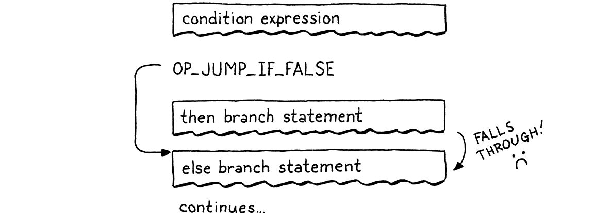
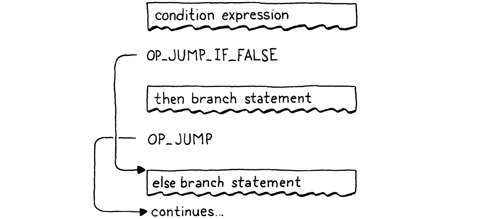
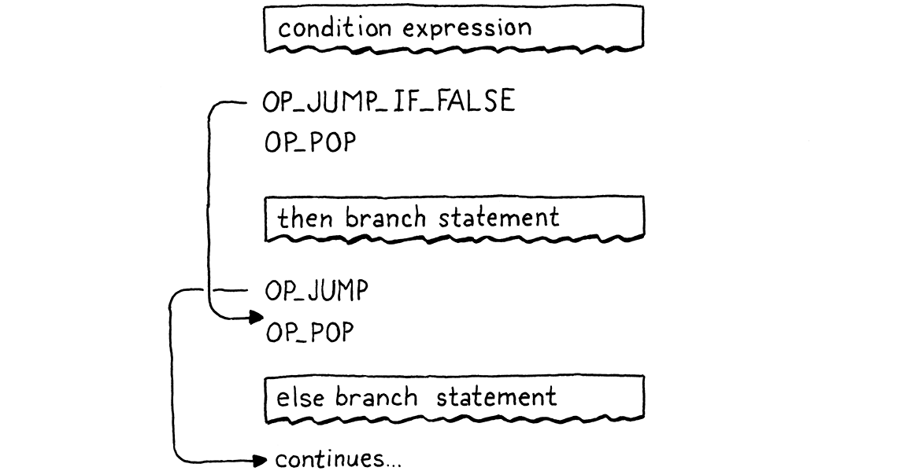
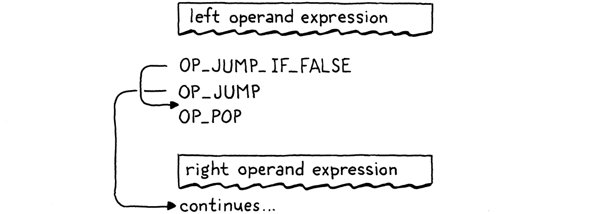
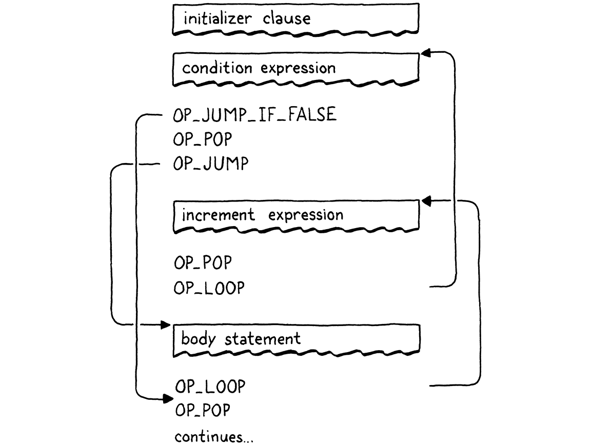

# 跳转控制

> 我们头脑想象的规矩就像一张网，或者像一张梯子，是为了达到某种目的而建造的。但是后来你必须把梯子扔掉，因为你发现，即使它有用，也没有意义。
> 
> -- Umberto Eco,*The Name of the Rose*

到达这里需要一段时间，但我们终于准备好将控制流添加到虚拟机。在我们为 jlox 构建的树遍历解释器中，我们根据 Java 实现了 Lox 的控制流。为了执行 Lox`if`语句，我们使用了 Java`if`语句来运行选定的分支。这行得通，但并不完全令人满意。*JVM 本身*或本机 CPU是通过什么魔法实现`if`语句的？现在我们有了自己的字节码 VM 可以破解，我们可以回答这个问题。

当谈论“控制流”时，指的是什么？“流程flow”是指执行时移动通过程序文本的方式。几乎就像计算机内部有一个小机器人在代码中徘徊，到处执行点点滴滴。Flow 是机器人所走的路径，通过*控制*机器人，可以驱动它执行哪些代码。

在 jlox 中，机器的关注点——当前的代码点——是隐含的，基于 存储在各种 Java 变量中哪些 AST 节点以及正在运行的 Java 代码。在 clox 中，它更加明确。VM 的`ip`字段存储当前字节码指令的地址。该字段的值恰好是程序中的“我们所在的位置”。

执行时通过递增`ip`。但是可以随心所欲地改变那个变量。为了实现控制流，所有必要的就是以更有趣的方式改变`ip`。最简单的控制流结构是一个`if`但没有`else`子句的语句：

```c
if (condition) print("condition was truthy");
```

VM 计算条件表达式的字节码。如果结果为真，则它继续执行`print`主体中的语句。有趣的情况是条件为假时。当发生这种情况时，执行将跳过 then 分支并继续执行下一条语句。

要跳过一段代码，我们只需将该`ip`字段设置为该代码之后的字节码指令的地址。要有条件地跳过某些代码，我们需要一条指令来查看堆栈顶部的值。如果它是假的，它会添加给定的偏移量以`ip`跳过一系列指令。否则，它什么都不做，让执行照常进行到下一条指令。

当我们编译成字节码时，代码的显式嵌套块结构消失了，只留下一系列扁平的指令。Lox 是一种[结构化编程](https://en.wikipedia.org/wiki/Structured_programming)语言，但 clox 字节码不是。正确或错误，取决于你如何看待它——一组字节码指令可以跳到一个块的中间，或者从一个范围跳到另一个范围。

VM 会愉快地执行它，即使结果使堆栈处于未知的、不一致的状态。因此，即使字节码是非结构化的，我们也会注意确保编译器只生成保持与 Lox 本身相同的结构和嵌套的干净代码。

这正是真实 CPU 的行为方式。即使我们可能使用结构化控制流的高级语言对它们进行编程，编译器也会将其降低为原始跳转。在底层，事实证明 goto 是唯一真正的控制流。

不管怎样，我并不是要搞哲学。重要的一点是，如果我们有一个条件跳转指令，只要它没有`else`子句，就足以实现 Lox 的 `if`语句。因此，让我们继续并开始吧。

## 23.1 if语句

这么多章节了，你已经知道套路了。任何新功能都从前端开始，并通过管道发挥作用。一个`if`语句，嗯，一个语句，所以这是我们将它挂接到解析器的地方。

```c
  if (match(TOKEN_PRINT)) {
    printStatement();
  } else if (match(TOKEN_IF)) {
    ifStatement();
  } else if (match(TOKEN_LEFT_BRACE)) {
// compiler.c, in statement()
```

当我们看到一个`if`关键字时，我们将编译交给这个函数：

```c
static void ifStatement() {
  consume(TOKEN_LEFT_PAREN, "Expect '(' after 'if'.");
  expression();
  consume(TOKEN_RIGHT_PAREN, "Expect ')' after condition."); 

  int thenJump = emitJump(OP_JUMP_IF_FALSE);
  statement();

  patchJump(thenJump);
}
// compiler.c, add after expressionStatement()
```

> 你有没有注意到关键字`if`之后的`(`实际上没有做任何有用的事情？如果没有它，该语言将同样明确且易于解析，例如：
> 
> ```c
> if condition) print("looks weird");
> ```

> 关闭的`)`很有用，因为它将条件表达式与正文分开。有些语言使用`then`关键字代替。但是开始的`(`并没有做任何事情。它仅在那里，因为不匹配的括号对我们人类来说看起来很糟糕。

首先编译条件表达式，用圆括号括起来。在运行时，这会将条件值留在堆栈顶部。将使用它来确定是执行 then 分支还是跳过它。

然后我们发出一条新`OP_JUMP_IF_FALSE`指令。它有一个操作数，表示要偏移多少`ip`——要跳过多少字节的代码。如果条件为假，它会`ip`按该数量调整。是这样的：

> 此处带有撕裂边缘的框表示通过编译控制流构造的某些子句生成的字节码块。所以“条件表达式”框是我们编译该表达式时发出的所有指令。


但是有一个问题。当我们写`OP_JUMP_IF_FALSE`指令的操作数时，怎么知道要跳多远？还没有编译 then 分支，所以不知道它包含多少字节码。

为了解决这个问题，使用了一个经典的技巧，叫做**backpatching**。首先使用占位符代替操作数发出跳转指令偏移。跟踪那条完成了一半的指令会跳转到哪里。接下来，编译 then 主体。一旦完成，现在就知道要跳多远。所以回去用真正的偏移量替换占位符偏移量，因为我们可以计算它了。有点像将补丁缝到已编译代码的现有结构上。


我们将这个技巧编码为两个辅助函数。

```c
static int emitJump(uint8_t instruction) {
  emitByte(instruction);
  emitByte(0xff);
  emitByte(0xff);
  return currentChunk()->count - 2;
}
// compiler.c, add after emitBytes()
```

第一个发出操作码指令并为跳转偏移写入一个占位符操作数。我们将操作码作为参数传入，因为稍后将有两个不同的指令使用这个辅组函数。使用两个字节作为跳转偏移操作数。16 位偏移量让我们可以跳过多达 65,535 字节的代码，这应该足以满足我们的需要。

> 一些指令集有单独的“长”跳转指令，当您需要跳转更远的距离时，这些指令需要更大的操作数。

该函数返回块中发出的指令的偏移量。编译 then 分支后，获取该偏移量并将其传给此：

```c
static void patchJump(int offset) {
  // -2 to adjust for the bytecode for the jump offset itself.
  int jump = currentChunk()->count - offset - 2;

  if (jump > UINT16_MAX) {
    error("Too much code to jump over.");
  }

  currentChunk()->code[offset] = (jump >> 8) & 0xff;
  currentChunk()->code[offset + 1] = jump & 0xff;
}
// compiler.c, add after emitConstant()
```

这将返回到字节码，并用计算出的跳转偏移量替换给定位置的操作数。在发出下一条希望跳转的指令之前立即调用`patchJump()`，因此它使用当前字节码计数来确定跳转多远。在`if`语句的情况下，这意味着在编译 then 分支之后和编译下一个语句之前。

这就是我们在编译时所需要的。让我们定义新指令。

```c
  OP_PRINT,
  OP_JUMP_IF_FALSE,
  OP_RETURN,
// chunk.h, in enum OpCode
```

在 VM 中，我们让它像这样工作：

```c
        break;
      }
      case OP_JUMP_IF_FALSE: {
        uint16_t offset = READ_SHORT();
        if (isFalsey(peek(0))) vm.ip += offset;
        break;
      }
      case OP_RETURN: {
// vm.c, in run()
```

这是添加的第一条采用 16 位操作数的指令。为了从块中读取它，我们使用了一个新的宏。

```c
#define READ_CONSTANT() (vm.chunk->constants.values[READ_BYTE()])
#define READ_SHORT() \
    (vm.ip += 2, (uint16_t)((vm.ip[-2] << 8) | vm.ip[-1]))
#define READ_STRING() AS_STRING(READ_CONSTANT())
// vm.c, in run()
```

它从块中抽出接下来的两个字节，并从中构建一个 16 位无符号整数。像往常一样，在用完后取消定义。

```c
#undef READ_BYTE
#undef READ_SHORT
#undef READ_CONSTANT
// vm.c, in run()
```

读取偏移量后，我们检查栈顶部的条件值。如果它是假的，我们将这个跳跃偏移应用到`ip`.否则，我们不理`ip`会，执行将自动进行到跳转指令之后的下一条指令。

在条件为假的情况下，不需要做任何其他工作。我们已经偏移了`ip`，因此当外部指令调度循环再次转动时，它将在该新指令处开始执行，经过 then 分支中的所有代码。

> 我说了不会用C的`if`语句来实现Lox的控制流，但是这里确实用了一个来判断是否偏移指令指针。但我们并没有真正使用 C 来*控制流程*。如果我们愿意，我们可以纯算术地做同样的事情。假设我们有一个函数`falsey()`，它接受一个 Lox 值，如果它为假则返回 1，否则返回 0。然后我们可以像这样实现跳转指令：
> 
> ```c
> case OP_JUMP_IF_FALSE: {
>   uint16_t offset = READ_SHORT();
>   vm.ip += falsey() * offset;
>   break;
> }
> ```

> 该`falsey()`函数可能会使用一些控制流来处理不同的值类型，但这是该函数的实现细节，不会影响我们的 VM 如何执行自己的控制流。

请注意，跳转指令不会将条件值弹出堆栈。所以这里还没有完全完成，因为这会在堆栈上留下一个额外的值。我们很快就会把它清理干净。暂时忽略这一点，现在在 Lox 中确实有一个可以工作的`if`语句，只需要一条小指令即可在 VM 运行时支持它。

### 23.1.1 Else子句

`if`语句没有`else`子句支持就像没有 Gomez 的 Morticia Addams。所以，在编译 then 分支之后，寻找一个`else`关键字。如果找到一个，则编译 else 分支。

```c
  patchJump(thenJump);

  if (match(TOKEN_ELSE)) statement();
}
// compiler.c, in ifStatement()
```

当条件为假时，将跳过 then 分支。如果有 else 分支，`ip`则正好在else 的开始。但这还不够。这是导致的流程：



如果条件为真，将按照需要执行 then 分支。但在那之后，执行将直接进入 else 分支。哎呀！当条件为真时，我们运行 then 分支后，需要跳过 else 分支。这样，无论哪种情况，我们都只执行一个分支，如下所示：



为了实现它，我们需要从 then 分支的末尾再次跳转。

```c
  statement();

  int elseJump = emitJump(OP_JUMP);

  patchJump(thenJump);
// compiler.c, in ifStatement()
```

我们在 else 主体结束后修补该偏移量。

```c
  if (match(TOKEN_ELSE)) statement();
  patchJump(elseJump);
}
// compiler.c, in ifStatement()
```

执行完 then 分支后，这会跳转到 else 分支之后的下一条语句。与其他跳跃不同，此跳跃是无条件的。我们总是接受它，所以需要另一条指令来表达这一点。

```c
  OP_PRINT,
  OP_JUMP,
  OP_JUMP_IF_FALSE,
// chunk.h, in enum OpCode
```

我们这样解释：

```c
        break;
      }
      case OP_JUMP: {
        uint16_t offset = READ_SHORT();
        vm.ip += offset;
        break;
      }
      case OP_JUMP_IF_FALSE: {
// vm.c, in run()
```

这里没什么好奇怪的——唯一的区别是它不检查条件并且总是应用偏移量。

现在then 和 else 分支都可以工作了，我们又完成了一点。最后一点是清理留在堆栈中的条件值。请记住，每条语句都必须具有零堆栈效应——语句执行完毕后，堆栈应与之前一样高。

我们可以让`OP_JUMP_IF_FALSE`指令弹出条件本身，但后边将会在 不希望pop的 条件的逻辑运算符中使用相同的指令。所以，我们会让编译器在编译`if`语句时发出几条明确的`OP_POP`指令。需要注意通过生成代码的每个执行路径都要弹出条件。

当条件为真时，我们就在 then 分支内的代码之前弹出它。

```c
  int thenJump = emitJump(OP_JUMP_IF_FALSE);
  emitByte(OP_POP);
  statement();
// compiler.c, in ifStatement()
```

否则，我们将它弹出到 else 分支的开头。

```c
  patchJump(thenJump);
  emitByte(OP_POP);

  if (match(TOKEN_ELSE)) statement();
// compiler.c, in ifStatement() 
```

这里的这条小指令还意味着每个`if`语句都有一个隐含的 else 分支，即使用户没有编写`else`子句。在他们离开的情况下，所有分支所做的就是丢弃条件值。

完整的正确流程如下所示：



如果仔细查看，您会发现它始终执行单个分支并确保首先弹出条件。剩下的就是一点反汇编支持。

```c
      return simpleInstruction("OP_PRINT", offset);
    case OP_JUMP:
      return jumpInstruction("OP_JUMP", 1, chunk, offset);
    case OP_JUMP_IF_FALSE:
      return jumpInstruction("OP_JUMP_IF_FALSE", 1, chunk, offset);
    case OP_RETURN:
// debug.c, in disassembleInstruction()
```

这两条指令有一个 16 位操作数的新格式，因此我们添加了一个新的实用函数来反汇编它们。

```c
static int jumpInstruction(const char* name, int sign,
                           Chunk* chunk, int offset) {
  uint16_t jump = (uint16_t)(chunk->code[offset + 1] << 8);
  jump |= chunk->code[offset + 2];
  printf("%-16s %4d -> %d\n", name, offset,
         offset + 3 + sign * jump);
  return offset + 3;
}
// debug.c, add after byteInstruction()
```

好了，这是一个完整的控制流结构。如果这是一部 80 年代的电影，蒙太奇音乐就会开始，其余的控制流语法就会自行处理。l嗯，80 年代早已结束，所以我们必须自己努力。

> 尽管我对 Depeche Mode 有着持久的热爱。

## 23.2 逻辑运算符

您可能还记得 jlox 中的这一点，但逻辑运算符`and`和`or`不仅仅是另一对二元运算符，例如`+`and`-`。因为它们短路并且可能不会根据左侧操作数的值来计算右侧操作数，所以它们更像是控制流表达式。

它们基本上是`if`带有`else`子句的一些变体。解释它们的最简单方法是只向您展示编译器代码及其在生成的字节码中产生的控制流。从 `and`开始，我们将其挂接到这里的表达式解析表中：

```c
  [TOKEN_NUMBER]        = {number,   NULL,   PREC_NONE},
  [TOKEN_AND]           = {NULL,     and_,   PREC_AND},
  [TOKEN_CLASS]         = {NULL,     NULL,   PREC_NONE},
// compiler.c, replace 1 line
```

这将交给一个新的解析器函数。

```c
static void and_(bool canAssign) {
  int endJump = emitJump(OP_JUMP_IF_FALSE);

  emitByte(OP_POP);
  parsePrecedence(PREC_AND);

  patchJump(endJump);
}
// compiler.c, add after defineVariable()
```

在这被调用时，左边的表达式已经被编译。这意味着在运行时，它的值将位于堆栈的顶部。如果那个值是假的，那么就知道整个表达式`and`一定是假的，所以我们跳过右边的操作数，把左边的值作为整个表达式的结果。否则，丢弃左边的值并计算右边的操作数，它成为整个`and`表达式的结果。

那四行代码就是这样产生的。流程如下所示：


现在您可以了解为什么`OP_JUMP_IF_FALSE`将值保留在堆栈顶部。当`and`的左侧为假时，该值会保留下来成为整个表达式的结果。

> 我们的操作码范围内还有足够的空间，所以可以为隐式弹出和不弹出的条件跳转提供单独的指令。但我试图让这本书的东西最少。在您的字节码 VM 中，值得探索添加更多专用指令并查看它们如何影响性能。

### 23.2.1 or运算符

`or`运算符稍微复杂一些。首先我们将它添加到解析表中。

```c
  [TOKEN_NIL]           = {literal,  NULL,   PREC_NONE},
  [TOKEN_OR]            = {NULL,     or_,    PREC_OR},
  [TOKEN_PRINT]         = {NULL,     NULL,   PREC_NONE},
// compiler.c, replace 1 line
```

当该解析器使用一个中缀`or` token时，它调用这个：

```c
static void or_(bool canAssign) {
  int elseJump = emitJump(OP_JUMP_IF_FALSE);
  int endJump = emitJump(OP_JUMP);

  patchJump(elseJump);
  emitByte(OP_POP);

  parsePrecedence(PREC_OR);
  patchJump(endJump);
}
// compiler.c, add after number()
```

在`or`表达式中，如果左侧为*真*，则我们跳过右侧操作数。因此，需要在值为真时跳转。我们可以添加一个单独的指令，但只是为了展示编译器如何自由地将语言的语义映射到它想要的任何指令序列，我根据我们已有的跳转指令来实现它。

当左侧为 false 时，它会略微跳到下一个语句。该语句是无条件地跳过正确操作数的代码。当值为 truthy 时，这个小舞蹈有效地跳了起来。流程如下所示：



老实说，这不是最好的方法。需要更多的指令要执行和更多的开销。没有充分的理由证明为什么`or`应该比`and`. 但很有趣的是，可以在不添加任何新指令的情况下实现这两个运算符。原谅我的放纵。

好的，这就是 Lox 中的三个*分支*结构。也就是说，我的意思是，这些控制流功能只会跳过代码。其他语言通常有某种多路分支语句，比如`switch`，也许还有条件表达式`?:`，但 Lox 保持简单。

## 23.3 while语句

这将我们带到*循环*语句，它*向后*跳转以便使代码可以多次执行。Lox 只有两个循环结构，`while`和`for`. `while`循环更简单，所以我们从这里开始

```c
    ifStatement();
  } else if (match(TOKEN_WHILE)) {
    whileStatement();
  } else if (match(TOKEN_LEFT_BRACE)) {
// compiler.c, in statement()
```

当我们到达一个`while`  token时，我们调用：

```c
static void whileStatement() {
  consume(TOKEN_LEFT_PAREN, "Expect '(' after 'while'.");
  expression();
  consume(TOKEN_RIGHT_PAREN, "Expect ')' after condition.");

  int exitJump = emitJump(OP_JUMP_IF_FALSE);
  emitByte(OP_POP);
  statement();

  patchJump(exitJump);
  emitByte(OP_POP);
}
// compiler.c, add after printStatement()
```

基本上和`if`语句一样——编译条件表达式，用强制性括号括起来。紧接着是一条跳转指令，如果条件为假，则跳过后续的主体语句。

在编译主体后修补跳转，并注意从任一路径的堆栈中弹出条件值。与`if`语句的唯一区别是循环。看起来像这样：

> 真的开始怀疑我对逻辑运算符使用相同跳转指令的决定。

```c
  statement();
  emitLoop(loopStart);

  patchJump(exitJump);
// compiler.c, in whileStatement()
```

在主体之后，我们调用此函数来发出“loop”指令。该指令需要知道跳回多远。向前跳时，必须分两个阶段发出指令，因为在发出跳转指令之前不知道要跳多远。我们现在没有那个问题。我们已经编译了我们想要跳回的代码点——它就在条件表达式之前。

我们需要做的就是在编译时捕获该位置。

```c
static void whileStatement() {
  int loopStart = currentChunk()->count;
  consume(TOKEN_LEFT_PAREN, "Expect '(' after 'while'.");
// compiler.c, in whileStatement()
```

执行`while`循环体后，我们一直跳回到条件之前。这样，在每次迭代时重新评估条件表达式。将块的当前指令计数存储在字节码中，`loopStart`以记录我们即将编译的条件表达式之前的字节码偏移量。然后将它传递给这个辅助函数：

```c
static void emitLoop(int loopStart) {
  emitByte(OP_LOOP);

  int offset = currentChunk()->count - loopStart + 2;
  if (offset > UINT16_MAX) error("Loop body too large.");

  emitByte((offset >> 8) & 0xff);
  emitByte(offset & 0xff);
}
// compiler.c, add after emitBytes()
```

有点像`emitJump()`和`patchJump()`的结合。它发出一个新的循环指令，该指令无条件地*向后*跳转给定的偏移量。像跳转指令一样，之后我们有一个 16 位操作数。计算从当前所在的指令到`loopStart`想要跳回的点的偏移量。这`+ 2`是为了考虑到`OP_LOOP` ，我们也需要跳过的指令自身操作数的大小。

从 VM 的角度来看，`OP_LOOP`和`OP_JUMP`之间确实没有语义差异。两者都只是向`ip`增加偏移. 我们可以为两者使用一条指令，并给它一个带符号的偏移量操作数。但我认为避开手动将带符号的 16 位整数打包成两个字节所需的烦人的操作要容易一些，而且我们有可用的操作码空间，那么为什么不使用它呢？

新指令在这里：

```c
  OP_JUMP_IF_FALSE,
  OP_LOOP,
  OP_RETURN,
// chunk.h, in enum OpCode
```

在虚拟机中，我们这样实现：

```c
      }
      case OP_LOOP: {
        uint16_t offset = READ_SHORT();
        vm.ip -= offset;
        break;
      }
      case OP_RETURN: {
// vm.c, in run()
```

唯一的区别`OP_JUMP`是减法而不是加法。反汇编也类似。

```c
      return jumpInstruction("OP_JUMP_IF_FALSE", 1, chunk, offset);
    case OP_LOOP:
      return jumpInstruction("OP_LOOP", -1, chunk, offset);
    case OP_RETURN:
// debug.c, in disassembleInstruction()
```

这是我们的`while`语句。它包含两个跳转-一个有条件的向前跳转，当条件不满足时跳出循环，以及一个无条件的向后循环，在执行完主体之后。流程如下所示：


## 23.4 for 语句

Lox 中的另一个循环语句是古老的`for`循环，它继承自 C。与`while`循环相比，它有更多的功能。它包含三个子句，所有子句都是可选的：

- 初始值设定项可以是变量声明或表达式。它在语句的开头运行一次。

- 条件子句是一个表达式。就像在`while`循环中一样，当它的计算结果为错误时，我们退出循环。

- 增量表达式在每次循环迭代结束时运行一次。

> 如果您想复习一下，第二部分中的相应章节[将更详细地介绍](http://craftinginterpreters.com/control-flow.html#for-loops)语义。

在 jlox 中，解析器将`for`循环脱糖为`while`循环之前和主体末尾添加一些额外的内容 的组合AST。我们将做类似的事情，尽管不会像 AST 那样经历任何事情。相反，字节码编译器将使用已有的跳转和循环指令。

我们将逐步完成实现，从`for`关键字开始

```c
    printStatement();
  } else if (match(TOKEN_FOR)) {
    forStatement();
  } else if (match(TOKEN_IF)) {
// compiler.c, in statement()
```

它调用辅助函数。如果我们只支持`for`带有空子句的循环`for (;;)`，那么我们可以这样实现它：

```c
static void forStatement() {
  consume(TOKEN_LEFT_PAREN, "Expect '(' after 'for'.");
  consume(TOKEN_SEMICOLON, "Expect ';'.");

  int loopStart = currentChunk()->count;
  consume(TOKEN_SEMICOLON, "Expect ';'.");
  consume(TOKEN_RIGHT_PAREN, "Expect ')' after for clauses.");

  statement();
  emitLoop(loopStart);
}
// compiler.c, add after expressionStatement()
```

顶部有一堆强制性标点符号。然后我们编译主体。就像我们对`while`循环所做的那样，我们在主体的顶部记录字节码偏移量，并发出一个循环以跳回到它之后的那个点。现在已经有了无限循环的工作实现。

> 如果没有`return`语句，除了运行时错误之外没有任何方法可以终止它。

### 23.4.1 for初始化子句

现在我们将添加第一个子句，初始化器。它只在主体之前执行一次，因此编译很简单。

```c
  consume(TOKEN_LEFT_PAREN, "Expect '(' after 'for'.");
  if (match(TOKEN_SEMICOLON)) {
    // No initializer.
  } else if (match(TOKEN_VAR)) {
    varDeclaration();
  } else {
    expressionStatement();
  }

  int loopStart = currentChunk()->count;
// compiler.c, in forStatement(), replace 1 line
```

语法有点复杂，因为我们允许变量声明或表达式。使用`var`关键字的存在来判断有哪些。对于表达式情况，我们调用`expressionStatement()`代替`expression()`。它寻找一个分号，在这里也需要它，并且还发出一条`OP_POP`指令来丢弃该值。我们不希望初始化器在堆栈上留下任何东西。

如果一条`for`语句声明了一个变量，那么该变量的作用域应该是循环体。我们通过将整个语句包装在一个作用域内来确保这一点。

```c
static void forStatement() {
  beginScope();
  consume(TOKEN_LEFT_PAREN, "Expect '(' after 'for'.");
// compiler.c, in forStatement()
```

然后我们在最后关闭它。

```c
  emitLoop(loopStart);
  endScope();
}
// compiler.c, in forStatement()
```

### 23.4.2 for 条件子句

接下来，是可用于退出循环的条件表达式。

```c
  int loopStart = currentChunk()->count;
  int exitJump = -1;
  if (!match(TOKEN_SEMICOLON)) {
    expression();
    consume(TOKEN_SEMICOLON, "Expect ';' after loop condition.");

    // Jump out of the loop if the condition is false.
    exitJump = emitJump(OP_JUMP_IF_FALSE);
    emitByte(OP_POP); // Condition.
  }

  consume(TOKEN_RIGHT_PAREN, "Expect ')' after for clauses.");
// compiler.c, in forStatement(), replace 1 line
```

由于该子句是可选的，我们需要查看它是否实际存在。如果该子句被省略，下一个token必须是分号，所以我们寻找它来说明。如果没有分号，则必须有一个条件表达式。

在那种情况下，我们编译它。然后，就像 while 一样，如果条件为假，会发出一个退出循环的条件跳转。由于跳转将值留在堆栈上，我们在执行主体之前将其弹出。这确保我们在条件为真时丢弃该值。

在循环体之后，我们需要修补那个跳转。

```c
  emitLoop(loopStart);

  if (exitJump != -1) {
    patchJump(exitJump);
    emitByte(OP_POP); // Condition.
  }

  endScope();
}
// compiler.c, in forStatement()
```

我们仅在有条件子句时才这样做。如果没有，则不会跳转到补丁，堆栈上也不会弹出任何条件值。

### 23.4.3 for 自增子句

我把最好的留到最后，自增子句。这很复杂。它以文本形式出现在循环体之前，但在循环体之后执行。如果我们解析为 AST 并在单独的一趟遍历中生成代码，我们可以简单地遍历并编译`for`语句 AST 的 body 字段之前的 increment 子句。

不幸的是，我们不能稍后increment子句，因为编译器只对代码进行一次遍历。作为代替，我们将*跳过*增量，运行主体，跳*回到*增量，运行它，然后转到下一个迭代。

我知道，有点奇怪，但是，嘿，它胜过在 C 中手动管理内存中的 AST，对吧？这是代码：

```c
  }

  if (!match(TOKEN_RIGHT_PAREN)) {
    int bodyJump = emitJump(OP_JUMP);
    int incrementStart = currentChunk()->count;
    expression();
    emitByte(OP_POP);
    consume(TOKEN_RIGHT_PAREN, "Expect ')' after for clauses.");

    emitLoop(loopStart);
    loopStart = incrementStart;
    patchJump(bodyJump);
  }

  statement();
// compiler.c, in forStatement(), replace 1 line
```

同样，它是可选的。由于这是最后一个子句，因此省略时，下一个标记将是右括号。当存在增量时，现在需要编译它，但它不应该执行。因此，首先，我们发出一个无条件跳转，从increment子句的代码跳到循环体。

接下来，我们编译increment表达式本身。这通常是一个赋值。不管它是什么，我们只是为了它的副作用而执行它，所以我们也发出一个 pop 来丢弃它的值。

最后一部分有点棘手。首先，发出一个循环指令。这是将我们带回到`for`循环顶部的主循环——如果有的话，就在条件表达式之前。该循环紧接在increment之后发生，因为increment在每次循环迭代结束时执行。

然后我们更改`loopStart`为指向increment表达式开始的偏移量。稍后，当我们在主体语句之后发出循环指令时，这将导致它跳到increment表达式而不是像没有increment时那样跳到循环顶部。这就是我们如何把increment织入在循环体之后。

这很复杂，但一切都解决了。包含所有子句的完整循环编译成这样的流程：



与在 jlox 中实现`for`循环一样，我们不需要接触运行时。这一切都被编译为 VM 已经支持的原始控制流操作。在本章中，我们向前迈进了一大步——clox现在是图灵完备的。我们还介绍了相当多的新语法：三个语句和两个表达式形式。即便如此，也只用了三个简单的新指令。对于我们的 VM 架构来说，这是一个相当不错的努力回报率。

> 我无法抗拒双关语。我一点儿都不后悔。

---

## [挑战](http://craftinginterpreters.com/jumping-back-and-forth.html#challenges)

1. 除了`if`语句之外，大多数 C 系列语言都有多路`switch`语句。将一个添加到 clox。语法是：
   
   ```
   switchStmt     → "switch" "(" expression ")"
                    "{" switchCase* defaultCase? "}" ;
   switchCase     → "case" expression ":" statement* ;
   defaultCase    → "default" ":" statement* ;
   ```
   
   要执行一条`switch`语句，首先计算括号内的switch表达式。然后执行case。对于每种情况，评估其值表达式。如果 case 值等于 switch 值，则执行 case 下的语句，然后退出`switch`语句。否则，尝试下一个case。如果没有 case 匹配并且有一个`default`子句，则执行它的语句。
   
   为了让事情更简单，我们省略了 失败 和`break`语句。每个 case 在其语句完成后自动跳转到 switch 语句的末尾。

2. 在 jlox 中，我们面临着添加对`break`语句的支持的挑战。这一次，让我们做`continue`：
   
   ```
   continueStmt   → "continue" ";" ;
   ```
   
   `continue`语句直接跳转到最近的封闭循环的顶部，跳过循环体的其余部分。在`for`循环内`continue`，如果有的话，`continue` 跳转到增量子句。没有包含在循环中的语句是编译时错误。
   
   一定要考虑范围。执行`continue` 时，在循环体内或嵌套在循环内的块中声明的局部变量应该如何处理？

3. 自 Algol 68 以来，控制流结构基本没有变化。从那时起，语言的演化一直集中在使代码更具声明性和更高级别，因此命令式控制流没有得到太多关注。
   
   为了好玩，尝试为 Lox 发明一种有用的新颖控制流功能。它可以是现有形式的改进或全新的东西。在实践中，很难在这种低表达水平上想出足够有用的东西来抵消强迫用户学习不熟悉的符号和行为的成本，但这是练习设计技能的好机会。

## [设计说明：思考GOTO的坏处 ](http://craftinginterpreters.com/jumping-back-and-forth.html#design-note)

发现我们在 Lox 中所有漂亮的结构化控制流实际上被编译为原始的非结构化跳跃，就像史酷比中怪物撕下面具的那一刻。一直都是goto！除了在这种情况下，怪物*在*面具下。我们都知道 goto 是邪恶的。但是...为什么？

确实，您可以使用 goto 编写难以维护的代码。但我认为今天的大多数程序员都没有亲眼见过。这种风格已经很久没有流行了。如今，我们在篝火旁的恐怖故事中援引的是布吉人。

我们很少亲自面对这个怪物的原因是因为 Edsger Dijkstra 用他发表在*ACM 通讯*（1968 年 3 月）上的著名信件“Go To Statement Considered Harmful”杀死了它。一段时间以来，围绕结构化编程的争论一直很激烈，双方的拥护者都在争论，但我认为 Dijkstra 最值得称赞的是有效地结束了它。今天的大多数新语言都没有非结构化的跳转语句。

一封半页的信几乎单枪匹马地破坏了语言功能，这一定是非常令人印象深刻的东西。如果你还没有读过它，我鼓励你去读一读。这是计算机科学知识的开创性作品，是我们部落的祖传歌曲之一。此外，这是阅读学术 CS写作的一个很好的简短练习，这是一项很有用的技能。

也就是说，如果你能克服 Dijkstra 令人难以忍受的假谦虚、自我夸大的写作风格：

> 最近我发现了为什么使用 go to 语句会产生如此灾难性的后果。...当时我并没有太重视这个发现；我现在提交我的出版考虑，因为在最近出现该主题的讨论中，有人敦促我这样做。

啊，又是我众多发现中的一个。在喧闹的群众求我之前，我什至懒得写。

我已经通读了很多遍，还有一些批评、回应和评论。我充其量只是百感交集。在一个非常高的水平上，我和他在一起。他的一般论点是这样的：

1. 作为程序员，我们编写程序——静态文本——但我们关心的是实际运行的程序——它的动态行为。

2. 我们更擅长推理静态事物而不是动态事物。（他没有提供任何证据来支持这一说法，但我接受了。）

3. 因此，我们越能使程序的动态执行反映其文本结构越好。

这是一个好的开始。将我们的注意力吸引到我们编写的代码与机器内部运行的代码之间的分离是一个有趣的见解。然后他试图定义程序文本和执行之间的“对应关系”。对于一个在整个职业生涯中都在提倡更严格的编程的人来说，他的定义相当随意。他说：

> 现在让我们考虑如何表征过程的进展。（你可以非常具体地思考这个问题：假设一个过程，被认为是一个时间连续的动作，在一个任意动作之后停止，我们必须修复什么数据才能重做这个过程，直到非常相同的点？）

想象一下吧。你有两台计算机，在完全相同的输入上运行相同的程序——完全确定。您可以在执行过程中的任意点暂停其中之一。您需要向另一台计算机发送什么数据才能使其与第一台计算机一样准确地停止？

如果你的程序只允许像赋值这样的简单语句，那很容易。你只需要知道你执行的最后一条语句之后的点。基本上是一个断点，`ip`在我们的 VM 中，或错误消息中的行号。像这样添加分支控制流`if`并且`switch`不会再添加任何内容。即使标记指向分支内部，我们仍然可以知道我们在哪里。

添加函数调用后，您还需要更多东西。您可以在某个函数执行过程中暂停第一台计算机，但可能会从多个位置调用该函数。*要在整个程序*执行的同一点暂停第二台机器，您需要在*正确*调用该函数时暂停它。

因此，您不仅需要知道当前语句，而且对于尚未返回的函数调用，您还需要知道调用点的位置。换句话说，一个调用堆栈，虽然我不认为 Dijkstra 写这个的时候存在这个术语。绝妙的。

他指出循环使事情变得更难。如果你在循环体的中间暂停，你不知道已经运行了多少次迭代。所以他说你还需要保持迭代计数。而且，由于循环可以嵌套，因此您需要一堆这些（可能与调用堆栈指针交错，因为您也可以在外部调用中循环）。

这就是它变得奇怪的地方。所以我们现在真的在构建一些东西，你希望他解释 goto 如何打破所有这些。相反，他只是说：

> 随意使用 go to 语句的直接后果是，很难找到一组有意义的坐标来描述流程进度。

他没有证明这很难，也没有说明原因。他只是说了算。他确实说一种方法不能令人满意：

> 当然，使用 go to 语句仍然可以通过计数器来唯一地描述进度，该计数器计算自程序启动以来执行的操作数（即一种标准化时钟）。困难在于，这样的坐标虽然独一无二，但却毫无帮助。

但是...这实际上就是循环计数器所做的，他对这些很好。并不是说每个循环都是简单的“对于从 0 到 10 的每个整数”递增计数。许多是`while`具有复杂条件的循环。

举一个比较接近的例子，考虑 clox 核心的核心字节码执行循环。Dijkstra 认为该循环是易于处理的，因为我们可以简单地计算循环运行了多少次来推断其进度。但是对于某些用户编译的 Lox 程序中的每条执行指令，该循环都会运行一次。知道它执行了 6,201 条字节码指令真的能告诉我们 VM 维护者关于解释器状态的*任何*启发吗？

事实上，这个特殊的例子指向一个更深层次的真理。B?hm 和 Jacopini[证明](https://en.wikipedia.org/wiki/Structured_program_theorem)，*任何*使用 goto 的控制流都可以转换为仅使用排序、循环和分支的控制流。我们的字节码解释器循环是该证明的一个活生生的例子：它实现了 clox 字节码指令集的非结构化控制流，而不使用任何 gotos 本身。

这似乎反驳了 Dijkstra 的主张：您*可以*通过将 goto 转换为不使用 goto 的程序来为程序定义对应关系，然后使用该程序的对应关系，根据他的说法，这是可以接受的，因为它仅使用分支和循环。

但是，老实说，我在这里的论点也很薄弱。我认为我们俩基本上都是在做假数学，并使用假逻辑来进行本应是经验主义的、以人为本的论证。Dijkstra 是对的，一些使用 goto 的代码真的很糟糕。通过使用结构化控制流，其中大部分可以而且应该变成更清晰的代码。

通过从语言中完全消除 goto，您绝对可以避免使用 goto 编写错误的代码。迫使用户使用结构化控制流并使使用这些结构编写类似 goto 的代码成为一场艰苦的战斗可能是我们所有生产力的净胜利。

但有时我确实想知道我们是否把婴儿连同洗澡水一起倒掉了。在没有 goto 的情况下，我们经常求助于更复杂的结构化模式。“循环内的开关”是一个经典的例子。另一个是使用保护变量退出一系列嵌套循环：

```c
// See if the matrix contains a zero.
bool found = false;
for (int x = 0; x < xSize; x++) {
  for (int y = 0; y < ySize; y++) {
    for (int z = 0; z < zSize; z++) {
      if (matrix[x][y][z] == 0) {
        printf("found");
        found = true;
        break;
      }
    }
    if (found) break;
  }
  if (found) break;
}
```

这真的比下边的好：

```c
for (int x = 0; x < xSize; x++) {
  for (int y = 0; y < ySize; y++) {
    for (int z = 0; z < zSize; z++) {
      if (matrix[x][y][z] == 0) {
        printf("found");
        goto done;
      }
    }
  }
}
done:
```

> 您可以通过在每个循环的条件子句的开头插入来在没有`break`语句的情况下执行此操作——它们本身是一个有限的 goto-ish 结构。`!found &&`

我想我真正不喜欢的是我们今天基于恐惧做出语言设计和工程决策。今天很少有人对 goto 的问题和好处有任何微妙的了解。相反，我们只是认为它“被认为是有害的”。就个人而言，我从来没有发现教条是高质量创造性工作的良好起点。