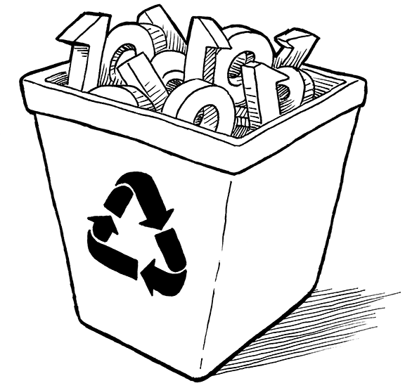
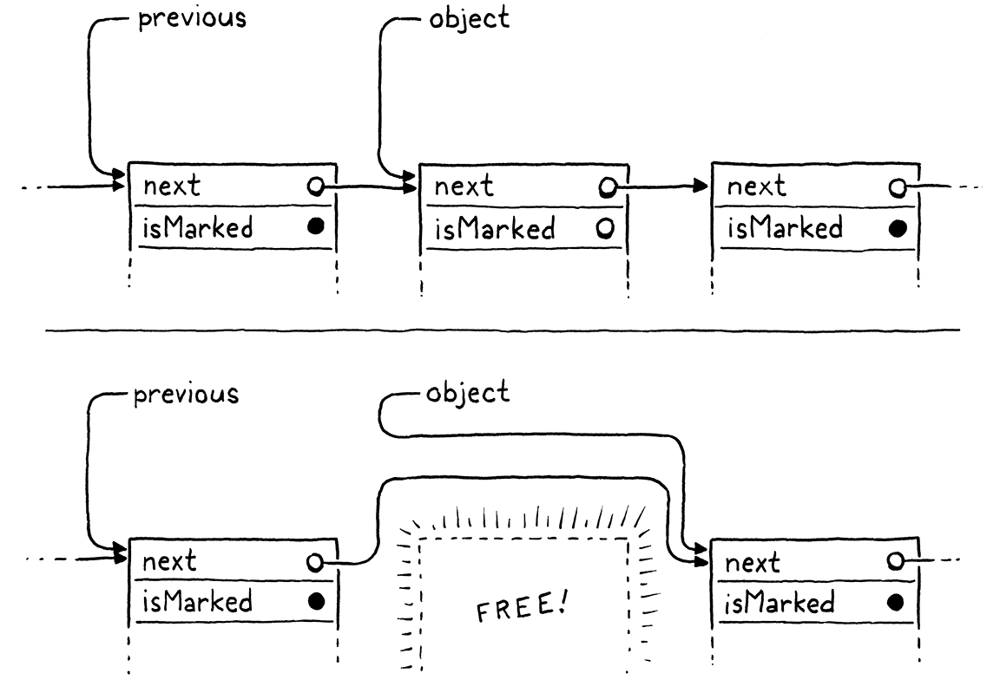
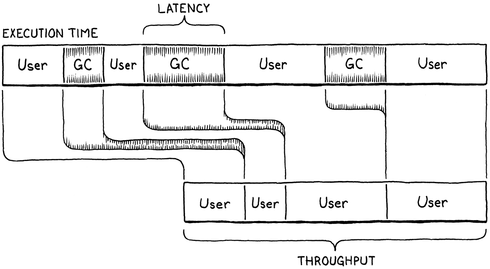
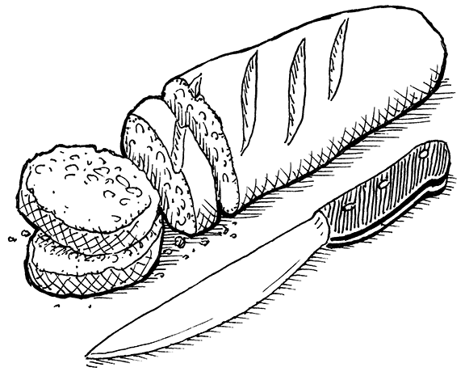

# 垃圾收集

> 我想要，我想要，  
> 我想要，我想要，  
> 我想要成为垃圾。  
> 
> -- The Whip, “Trash”

我们说 Lox 是一种“高级”语言，因为它使程序员不必担心与他们正在解决的问题无关的细节。用户变成了执行官，给机器抽象的目标，让低级的电脑自己想办法到达那里。

动态内存分配是自动化的完美候选者。这对于一个工作程序来说是必要的，手工完成很乏味，但仍然容易出错。不可避免的错误可能是灾难性的，导致崩溃、内存损坏或安全违规。这是机器比人类更擅长的那种既冒险又乏味的工作。

这就是 Lox 是一种**托管语言**的原因，这意味着语言实现代表用户管理内存分配和释放。当用户执行需要一些动态内存的操作时，VM 会自动分配它。程序员从不担心释放任何东西。该机器确保程序使用的任何内存都可以根据需要保留。

Lox 提供了计算机拥有无限量内存的错觉。用户可以分配、分配、再分配，而永远不会考虑所有这些字节是从哪里来的。当然，计算机还没有*无限的*内存。因此，托管语言维持这种错觉的方式是背着程序员回收程序不再需要的内存。执行此操作的组件称为**垃圾收集器**。

> 回收确实是一个更好的比喻。GC 不会*丢弃*内存，它会回收内存以用于新数据。但是托管语言比地球日还早，所以发明者使用了他们知道的类比。



## 26.1 可达性 reachability

这就提出了一个非常困难的问题：虚拟机如何判断哪些内存是不需要的？内存只有在将来读取时才需要，但是没有时间机器，实现如何告诉程序将执行什么代码以及它将使用哪些数据？剧透警报：虚拟机无法穿越到未来。相反，该语言进行了保守的近似：如果将来可能读取一块内存，它会认为它仍在使用中。

> 我在一般意义上使用“保守”。有一种叫做“保守垃圾收集器”的东西，它的意思更具体。*所有垃圾收集器都是“保守的”，因为如果可以*访问内存，它们会保持内存处于活动状态，而不是让他们更准确地知道将访问哪些数据的 Magic 8-Ball。
> 
> **保守 (GC conservative GC)** 是一种特殊类型的收集器，如果其中的值看起来可能是一个地址，它会将任何一块内存视为一个指针。这与我们将要实现的精确 GC 形成对比，后者确切地知道内存中的哪些单词是指针以及哪些存储其他类型的值，如数字或字符串。

这听起来太保守了。不能潜在地读取任何一点内存吗？(Couldn’t?*any*?bit of memory potentially be read?)  实际上，不，至少不是像 Lox 这样的内存安全语言。这是一个例子：

```js
var a = "first value";
a = "updated";
// GC here.
print a;
```

假设在第二行的分配完成后运行 GC。字符串“first value”仍在内存中，但用户程序永远无法访问它。一旦`a`重新分配，程序就会丢失对该字符串的任何引用。我们可以安全地释放它。如果用户程序可以通过某种方式引用某个值，则该值是**可达的**。否则，就像这里的字符串“first value”一样，是**不可达**的。

VM 可以直接访问许多值。看一眼：

```js
var global = "string";
{
  var local = "another";
  print global + local;
}
```

在连接两个字符串之后但在`print`执行语句之前立即暂停程序。VM 可以通过查看全局变量表并找到`global`的条目来访问`"string"`。它可以通过遍历值堆栈并命中局部变量`local`的槽来找到`"another"`。它甚至可以找到连接的字符串`"stringanother"`，因为在暂停程序时该临时值也位于 VM 的堆栈中。

所有这些值都称为**根 roots**。根是 VM 可以直接访问的任何对象，而无需通过其他对象中的引用。大多数根是全局变量或在堆栈上，但 正如我们将看到的，VM 在其他几个地方存储对它可以找到的对象的引用。

可以通过遍历另一个值中的引用来找到其他值。类实例上的字段是最明显的情况，但我们还没有这些。即使没有这些，VM 仍然有间接引用。考虑：

> [不过，我们很快](http://craftinginterpreters.com/classes-and-instances.html)就会到达那里！

```js
fun makeClosure() {
  var a = "data";

  fun f() { print a; }
  return f;
}

{
  var closure = makeClosure();
  // GC here.
  closure();
}
```

假设我们在标记行暂停程序并运行垃圾收集器。当收集器完成并且程序恢复时，它将调用闭包，闭包将打印`"data"`。所以收集器*不需要*释放那个字符串。但是当我们暂停程序时，栈是这样的：


`"data"`字符串不在上面。它已经从栈中取出并移动到闭包使用的关闭上值中。闭包本身在堆栈上。但是要获取字符串，我们需要跟踪闭包及其上值数组。由于用户的程序*有*可能这样做，所有这些可间接访问的对象也被认为是可访问的。


这为我们提供了可达性的归纳定义：

- 所有的根都是可达的。

- 从可达对象引用的任何对象本身都是可达的。

这些是仍然“活跃”并需要保留在内存中的值。任何不符合此定义的值都是垃圾收集器可以收集的。这对递归规则暗示了可以使用递归算法来释放不需要的内存：

1. 从根开始，遍历对象引用以找到完整的可达对象集。

2. *释放不在*该集合中的所有对象。

今天使用了许多不同的垃圾收集算法，但它们大致都遵循相同的结构。有些人可能会交错或混合这些步骤，但两个基本操作都在那里。它们的主要区别在于执行每个步骤的*方式。*

> 如果您想探索其他 GC 算法，[*The Garbage Collection Handbook*](http://gchandbook.org/)（Jones 等人）是规范的参考。对于如此深奥而狭隘的主题的大书，读起来还是很愉快的。或许我对乐趣有一种奇怪的想法。

## 26.2 标记清除垃圾收集

第一种托管语言是 Lisp，它是继 Fortran 之后发明的第二种“高级”语言。John McCarthy 考虑过使用手动内存管理或引用计数，但最终选择了（并发明了）垃圾收集——一旦程序内存不足，它将返回并找到可以回收的未使用存储空间。

> 在 John McCarthy 的“Lisp 的历史”中，他指出：“一旦我们决定进行垃圾收集，它的实际实现可能会被推迟，因为只做了玩具示例。” 我们选择拖延将 GC 添加到 clox 跟随巨人的脚步。

他设计了第一个最简单的垃圾收集算法，称为**mark-and-sweep**或简称**mark-sweep**。它的描述适合 Lisp 的初始论文中的三个短段落。尽管它年代久远且简单，但相同的基本算法是许多现代内存管理器的基础。CS 的某些角落似乎是永恒的。

顾名思义，标记-清除分两个阶段进行：

- **标记**：从根开始，遍历或追踪这些根所引用的所有对象。这是所有可达对象的经典图遍历。每次我们访问一个对象时，我们都会以某种方式标记它。（实现方式在记录标记的方式上有所不同。）

- **清除**：标记阶段完成后，堆中的每个可达对象都已被标记。这意味着任何未标记的对象都是不可到达的并且可以回收。我们遍历所有未标记的对象并释放每个对象。

它看起来像这样：


> **跟踪垃圾收集器**是通过对象引用图进行跟踪的任何算法。这与引用计数形成对比，引用计数具有不同的跟踪可达对象的策略。

这就是我们要实现的。每当决定是时候回收一些字节时，将跟踪所有内容并标记所有可达对象，释放未标记的对象，然后恢复用户程序。

### 26.2.1 收集垃圾

整章都是关于实现这个函数的：

> 当然，我们最终也会添加一堆辅助函数。

```c
void* reallocate(void* pointer, size_t oldSize, size_t newSize);
void collectGarbage();
void freeObjects();
// memory.h, add after reallocate()
```

我们将从这个空壳开始，逐步实现完整的实现：

```c
void collectGarbage() {
}
// memory.c, add after freeObject()
```

您可能会问的第一个问题是，这个函数什么时候被调用？事实证明这是一个微妙的问题，我们将在本章后面花一些时间来解决这个问题。现在将回避这个问题，并在此过程中为自己构建一个方便的诊断工具。

```c
#define DEBUG_TRACE_EXECUTION

#define DEBUG_STRESS_GC

#define UINT8_COUNT (UINT8_MAX + 1)
// common.h
```

我们将为垃圾收集器添加一个可选的“压力测试 (stress test)”模式。定义此标志后，GC 将尽可能频繁地运行。显然，这对性能来说是可怕的。但它非常适合清除仅在恰好触发 GC 时发生的内存管理错误。如果*每时每刻都*触发 GC，您很可能会发现这些错误。

```c
void* reallocate(void* pointer, size_t oldSize, size_t newSize) {
  if (newSize > oldSize) {
#ifdef DEBUG_STRESS_GC
    collectGarbage();
#endif
  }

  if (newSize == 0) {
// memory.c, in reallocate()
```

每当我们调用`reallocate()`以获取更多内存时，我们都会强制收集。if 检查是因为`reallocate()`还被调用以释放或收缩分配。我们不想为此触发 GC——特别是因为 GC 本身会调用`reallocate()`释放内存。

在分配之前收集是将 GC 连接到 VM 的经典方法。您已经调用了内存管理器，因此很容易挂接代码。此外，分配是您真正需要*释放内存以便重用它的唯一时间。如果您*不使用分配来触发 GC，则必须确保代码中可以循环和分配内存的每个可能位置也有触发收集器的方法。否则，虚拟机可能会进入饥饿状态，在这种状态下它需要更多内存但永远不会收集到任何内存。

> 更复杂的收集器可能在单独的线程上运行，或者在程序执行期间定期交错——通常在函数调用边界或发生向后跳转时。

### 26.2.2 调试日志

当我们讨论诊断主题时，让我们加入更多内容。我发现垃圾收集器的一个真正挑战是它们是不透明的。到目前为止，我们已经在没有任何 GC的情况下运行了很多 Lox 程序。一旦我们添加了一个，如何判断它是否在做任何有用的事情？只有当我们编写的程序能够遍历数英亩的内存时，我们才能判断吗？我们如何调试它？

了解 GC 内部工作原理的一种简单方法是使用一些日志记录。

```c
#define DEBUG_STRESS_GC
#define DEBUG_LOG_GC

#define UINT8_COUNT (UINT8_MAX + 1)
// common.h
```

启用后，clox 在对动态内存执行某些操作时会将信息打印到控制台。

我们需要一些包含。

```c
#include "vm.h"

#ifdef DEBUG_LOG_GC
#include <stdio.h>
#include "debug.h"
#endif

void* reallocate(void* pointer, size_t oldSize, size_t newSize) {
// memory.c
```

我们还没有收集器，但现在可以开始放入一些日志记录。我们想知道收集运行何时开始。

```c
void collectGarbage() {
#ifdef DEBUG_LOG_GC
  printf("-- gc begin\n");
#endif
}
// memory.c, in collectGarbage()
```

最终我们将在收集期间记录一些其他操作，因此我们也想知道节目何时结束。

```c
  printf("-- gc begin\n");
#endif

#ifdef DEBUG_LOG_GC
  printf("-- gc end\n");
#endif
}
// memory.c, in collectGarbage()
```

我们还没有收集器的任何代码，但是我们有分配和释放的函数，所以我们现在可以检测它们。

```c
  vm.objects = object;

#ifdef DEBUG_LOG_GC
  printf("%p allocate %zu for %d\n", (void*)object, size, type);
#endif

  return object;
// object.c, in allocateObject()
```

在对象的生命周期结束时：

```c
static void freeObject(Obj* object) {
#ifdef DEBUG_LOG_GC
  printf("%p free type %d\n", (void*)object, object->type);
#endif

  switch (object->type) {
// memory.c, in freeObject()
```

有了这两个标志，我们应该能够看到我们在完成本章的其余部分时正在取得进展。

## 26.3 标记根对象

对象像漆黑夜空中的星星一样散落在堆中。从一个对象到另一个对象的引用形成了一个连接，这些星座就是标记相位遍历的图形。标记从根部开始。

```c
#ifdef DEBUG_LOG_GC
  printf("-- gc begin\n");
#endif

  markRoots();

#ifdef DEBUG_LOG_GC
// memory.c, in collectGarbage()
```

大多数根是位于 VM 栈中的局部变量或临时变量，因此我们从遍历它开始。

```c
static void markRoots() {
  for (Value* slot = vm.stack; slot < vm.stackTop; slot++) {
    markValue(*slot);
  }
}
// memory.c, add after freeObject()
```

为了标记 Lox 值，我们使用这个新函数：

```c
void* reallocate(void* pointer, size_t oldSize, size_t newSize);
void markValue(Value value);
void collectGarbage();
// memory.h, add after reallocate()
```

它的实现在这里：

```c
void markValue(Value value) {
  if (IS_OBJ(value)) markObject(AS_OBJ(value));
}
// memory.c, add after reallocate()
```

一些 Lox 值（数字、布尔值和`nil`）直接内联存储在 Value 中，不需要堆分配。垃圾收集器根本不需要担心它们，所以我们做的第一件事就是确保该值是一个实际的堆对象。如果是这样，真正的工作发生在这个函数中：

```c
void* reallocate(void* pointer, size_t oldSize, size_t newSize);
void markObject(Obj* object);
void markValue(Value value);
// memory.h, add after reallocate()
```

这是在这里定义的：

```c
void markObject(Obj* object) {
  if (object == NULL) return;
  object->isMarked = true;
}
// memory.c, add after reallocate()
```

从`markValue()`调用时不需要检查`NULL`。某种 Obj 类型的 Lox 值将始终具有有效指针。但稍后我们将直接从其他代码调用此函数，并且在某些地方，指向的对象是可选的。

假设我们确实有一个有效的对象，通过设置一个标志来标记它。该新字段位于所有对象共享的 Obj 标头结构中。

```c
  ObjType type;
  bool isMarked;
  struct Obj* next;
// object.h, in struct Obj
```

每个新对象开始时都没有标记，因为我们还没有确定它是否可达。

```c
  object->type = type;
  object->isMarked = false;

  object->next = vm.objects;
// object.c, in allocateObject()
```

在我们继续之前，让我们添加一些日志记录到`markObject()`.

```c
void markObject(Obj* object) {
  if (object == NULL) return;
#ifdef DEBUG_LOG_GC
  printf("%p mark ", (void*)object);
  printValue(OBJ_VAL(object));
  printf("\n");
#endif

  object->isMarked = true;
// memory.c, in markObject()
```

这样我们就可以看到标记阶段在做什么。标记栈会处理局部变量和临时变量。根的另一个主要来源是全局变量。

```c
    markValue(*slot);
  }

  markTable(&vm.globals);
}
// memory.c, in markRoots()
```

它们位于 VM 拥有的哈希表中，因此我们将声明另一个辅助函数来标记表中的所有对象。

```c
ObjString* tableFindString(Table* table, const char* chars,
                           int length, uint32_t hash);
void markTable(Table* table);

#endif
// table.h, add after tableFindString()
```

我们在这里的“table”模块中实现它：

```c
void markTable(Table* table) {
  for (int i = 0; i < table->capacity; i++) {
    Entry* entry = &table->entries[i];
    markObject((Obj*)entry->key);
    markValue(entry->value);
  }
}
// table.c, add after tableFindString()
```

非常简单。我们遍历条目数组。对于每一个，都标记它的值。我们还标记每个条目的关键字符串，因为 GC 也管理这些字符串。

### 26.3.1 不明显的根

这些涵盖了我们通常认为的根对象——显式可以访问的值，因为它们存储在用户程序可以看到的变量中。但是 VM 有一些它自己的隐蔽孔，它会在其中隐藏对其直接访问的值的引用。

大多数函数调用状态位于值栈中，但 VM 维护一个单独的 CallFrames 栈。每个 CallFrame 都包含一个指向被调用的闭包的指针。VM 使用这些指针来访问常量和上值，因此也需要保留这些闭包。

```c
 }

  for (int i = 0; i < vm.frameCount; i++) {
    markObject((Obj*)vm.frames[i].closure);
  }

  markTable(&vm.globals);
// memory.c, in markRoots()
```

说到upvalues，open upvalue list是VM可以直接访问的另一组值。

```c
  for (int i = 0; i < vm.frameCount; i++) {
    markObject((Obj*)vm.frames[i].closure);
  }

  for (ObjUpvalue* upvalue = vm.openUpvalues;
       upvalue != NULL;
       upvalue = upvalue->next) {
    markObject((Obj*)upvalue);
  }

  markTable(&vm.globals);
// memory.c, in markRoots()
```

还请记住，收集可以在*任何*分配期间开始。这些分配不仅仅在用户程序运行时发生。编译器本身会定期从堆中获取文字和常量表的内存。如果 GC 在编译过程中运行，那么编译器直接访问的任何值也需要被视为根。

为了使编译器模块与 VM 的其余部分完全分开，我们将在一个单独的函数中执行此操作。

```c
  markTable(&vm.globals);
  markCompilerRoots();
}
// memory.c, in markRoots()
```

在这里声明：

```c
ObjFunction* compile(const char* source);
void markCompilerRoots();

#endif
// compiler.h, add after compile()
```

这意味着“memory”模块需要一个包含。

```c
#include <stdlib.h>

#include "compiler.h"
#include "memory.h"
// memory.c
```

并且定义在“compiler”模块中结束。

```c
void markCompilerRoots() {
  Compiler* compiler = current;
  while (compiler != NULL) {
    markObject((Obj*)compiler->function);
    compiler = compiler->enclosing;
  }
}
// compiler.c, add after compile()
```

幸运的是，编译器没有太多的值可以依赖。它使用的唯一对象是它编译成的 ObjFunction。由于函数声明可以嵌套，编译器有一个链表，我们遍历整个链表。

由于“编译器”模块正在调用`markObject()`，它还需要一个包含。

```c
#include "compiler.h"
#include "memory.h"
#include "scanner.h"
// compiler.c
```

这些都是根对象。运行此命令后，VM（运行时和编译器）可以在*不*通过其他对象的情况下访问的每个对象都设置了其标记位。

## 26.4 跟踪对象引用

标记过程的下一步是跟踪对象之间的引用图，以找到间接可达的值。我们还没有带字段的实例，所以没有很多对象包含引用，但我们确实有一些.特别是，ObjClosure 具有它关闭的 ObjUpvalues 列表以及对它包装的原始 ObjFunction 的引用。反过来，ObjFunction 有一个常量表，其中包含对函数主体中创建的所有文字的引用。这足以构建一个相当复杂的对象网络供我们的收集器爬行。

> 我特意将这一章放在本书中，*因为*现在有了闭包，它为我们提供了有趣的对象供垃圾收集器处理。

现在是实现该遍历的时候了。我们可以按广度优先、深度优先或其他顺序进行。因为我们只需要找到所有可达对象的集合，所以我们访问它们的顺序*基本上*无关紧要。

> 我说“大部分”是因为一些垃圾收集器按照对象被访问的顺序移动对象，因此遍历顺序决定了哪些对象最终在内存中相邻。这会影响性能，因为 CPU 使用局部性来确定将哪个内存预加载到缓存中。
> 
> 即使遍历顺序很重要，也不清楚哪种顺序*最好*。很难确定未来将使用哪些顺序对象，因此 GC 很难知道哪种顺序对性能有帮助。

### 26.4.1 三色抽象

当收集器在对象图中徘徊时，需要确保它不会迷失自己的位置或陷入困境。这对于高级实现尤其重要，例如将标记与用户程序的运行片段交织在一起的增量 GC。收集器需要能够暂停，然后在稍后停止的地方继续。

为了帮助我们这些头脑简单的人推理这个复杂的过程，VM 黑客想出了一个比喻，叫做**三色抽象**。每个对象都有一个概念性的“颜色”，用于跟踪对象所处的状态，以及还有哪些工作要做。

> 高级垃圾收集算法通常会在抽象中添加其他颜色。我在某些设计中看到过多种灰色阴影，甚至紫色。遗憾的是，我的 puce-chartreuse-fuchsia-malachite 收集器论文没有被接受发表。

- **白色**：在垃圾回收开始时，每个对象都是白色的。这种颜色意味着我们根本没有到达或处理该对象。

- **灰色**：在标记过程中，当我们第一次到达一个物体时，我们将其变暗为灰色。这种颜色意味着我们知道对象本身是可达的，不应该被收集。但是我们还没有通过它追踪*到*它引用了哪些*其他*对象。在图算法术语中，这是*工作列表*——我们知道但尚未处理的对象集。

- **黑色**：当我们拿一个灰色对象并标记它引用的所有对象时，我们就把灰色对象变成黑色。这种颜色表示标记阶段已完成对该对象的处理。

就该抽象而言，标记过程现在看起来像这样：

1. 从所有白色物体开始。

2. 找到所有的根并将它们标记为灰色。

3. 只要还有灰色对象就重复：
   
   1. 选择一个灰色对象。将对象引用到的任何白色对象变成灰色。
   
   2. 将原始灰色对象标记为黑色。

我发现它有助于形象化这一点。你有一个对象网，它们之间有引用。最初，它们都是小白点。旁边是一些来自 VM 的指向根的传入边。那些根变灰了。然后每个灰色对象的兄弟姐妹变成灰色，而对象本身变成黑色。完整的效果是穿过图形的灰色波前，在它后面留下一片可到达的黑色对象。无法到达的对象不会被波峰接触并保持白色。


最后，您会看到一片伸手可及的黑色对象的海洋，上面散布着白色物体的岛屿，这些物体可以被扫除并释放。一旦无法访问的对象被释放，剩余的对象（全黑）将重置为白色以用于下一个垃圾收集周期。

> 请注意，在此过程的每一步中，都没有黑色节点指向白色节点。此属性称为**三色不变量**。遍历过程维护此不变性以确保永远不会收集任何可到达的对象。

### 26.4.2 灰色对象的工作清单

在我们的实现中，已经标记了根。它们都是灰色的。下一步是开始挑选它们并遍历它们的引用。但是我们没有任何简单的方法可以找到它们。我们在对象上设置了一个字段，仅此而已。我们不想遍历整个对象列表来寻找具有该字段集的对象。

相反，我们将创建一个单独的工作列表来跟踪所有灰色对象。当对象变为灰色时，除了设置标记字段外，我们还将其添加到工作列表中。

```c
  object->isMarked = true;

  if (vm.grayCapacity < vm.grayCount + 1) {
    vm.grayCapacity = GROW_CAPACITY(vm.grayCapacity);
    vm.grayStack = (Obj**)realloc(vm.grayStack,
                                  sizeof(Obj*) * vm.grayCapacity);
  }

  vm.grayStack[vm.grayCount++] = object;
}
// memory.c, in markObject()
```

我们可以使用任何类型的数据结构，让我们可以轻松地放入和取出物品。我选择了一个栈，因为它是用 C 中的动态数组实现的最简单的方法。它的工作原理与我们在 Lox 中构建的其他动态数组大体相同，*除了*，注意它调用*系统*`realloc()`函数而不是我们自己的`reallocate()`包装器。灰栈本身的内存*不由*垃圾收集器管理。我们不希望在 GC 期间增加灰色栈导致 GC 递归地启动新的 GC。这可能会在时空连续体中撕开一个洞。

我们将自己明确地管理它的内存。VM 拥有灰色栈。

```c
  Obj* objects;
  int grayCount;
  int grayCapacity;
  Obj** grayStack;
} VM;
// vm.h, in struct VM
```

它开始是空的。

```c
  vm.objects = NULL;

  vm.grayCount = 0;
  vm.grayCapacity = 0;
  vm.grayStack = NULL;

  initTable(&vm.globals);
// vm.c, in initVM()
```

我们需要在 VM 关闭时释放它。

```c
    object = next;
  }

  free(vm.grayStack);
}
// memory.c, in freeObjects()
```

我们对此数组负全部责任。这包括分配失败。如果不能创建或增长灰色栈，那么就不能完成垃圾收集。这对 VM 来说是个坏消息，但幸运的是很少见，因为灰色栈往往非常小。做一些更优雅的事情会很好，但是为了使本书中的代码保持简单，我们只是中止了。

> 为了更加健壮，我们可以在启动 VM 时分配一个“未雨绸缪”内存块。如果灰栈分配失败，我们释放雨天块并重试。这可能会给我们在堆上提供足够的摆动空间来创建灰色堆栈、完成 GC 并释放更多内存。

```c
    vm.grayStack = (Obj**)realloc(vm.grayStack,
                                  sizeof(Obj*) * vm.grayCapacity);

    if (vm.grayStack == NULL) exit(1);
  }
// memory.c, in markObject()
```

### 26.4.3 处理灰色对象

好的，现在当我们完成标记根时，我们都设置了一堆字段并用要仔细研究的对象填充了工作列表。现在是下一阶段的时候了。

```c
  markRoots();
  traceReferences();

#ifdef DEBUG_LOG_GC
// memory.c, in collectGarbage()
```

这是实现：

```c
static void traceReferences() {
  while (vm.grayCount > 0) {
    Obj* object = vm.grayStack[--vm.grayCount];
    blackenObject(object);
  }
}
// memory.c, add after markRoots()
```

它尽可能接近文本算法。直到栈清空，我们不断地拉出灰色对象，遍历它们的引用，然后将它们标记为黑色。遍历对象的引用可能会出现新的白色对象，这些对象被标记为灰色并添加到栈中。所以这个函数在白色对象变灰和灰色对象变黑之间来回摆动，逐渐向前推进整个波峰。

这是我们遍历单个对象的引用的地方：

```c
static void blackenObject(Obj* object) {
  switch (object->type) {
    case OBJ_NATIVE:
    case OBJ_STRING:
      break;
  }
}
// memory.c, add after markValue()
```

每个对象种类都有可能引用其他对象的不同字段，因此我们需要为每种类型编写特定的代码块。我们从简单的开始——字符串和本机函数对象不包含传出引用，因此无需遍历。

> 我们可以做的一个简单的优化`markObject()`是完全跳过将字符串和本机函数添加到灰色堆栈，因为我们知道它们不需要处理。相反，它们可以从白色直接变黑。

请注意，我们没有在遍历对象本身中设置任何状态。对象状态中没有“黑色”的直接编码。黑色对象是其`isMarked`字段已设置且不再位于灰色堆栈中的任何对象。

> 你可能想知道为什么我们有这个`isMarked`字段。一切都来得及，朋友。

现在让我们开始添加其他对象类型。最简单的是上值。

```c
static void blackenObject(Obj* object) {
  switch (object->type) {
    case OBJ_UPVALUE:
      markValue(((ObjUpvalue*)object)->closed);
      break;
    case OBJ_NATIVE:
// memory.c, in blackenObject()
```

当上值关闭时，它包含对关闭值的引用。由于该值不再在堆栈上，我们需要确保从上值跟踪对它的引用。

接下来是函数。

```c
  switch (object->type) {
    case OBJ_FUNCTION: {
      ObjFunction* function = (ObjFunction*)object;
      markObject((Obj*)function->name);
      markArray(&function->chunk.constants);
      break;
    }
    case OBJ_UPVALUE:
// memory.c, in blackenObject()
```

每个函数都有一个对包含函数名称的 ObjString 的引用。更重要的是，该函数有一个常量表，其中包含对其他对象的引用。我们跟踪所有使用这个函数的函数：

```c
static void markArray(ValueArray* array) {
  for (int i = 0; i < array->count; i++) {
    markValue(array->values[i]);
  }
}
// memory.c, add after markValue()
```

现在拥有的最后一种对象类型——我们将在后面的章节中添加更多——是闭包。

```c
  switch (object->type) {
    case OBJ_CLOSURE: {
      ObjClosure* closure = (ObjClosure*)object;
      markObject((Obj*)closure->function);
      for (int i = 0; i < closure->upvalueCount; i++) {
        markObject((Obj*)closure->upvalues[i]);
      }
      break;
    }
    case OBJ_FUNCTION: {
// memory.c, in blackenObject()
```

每个闭包都有一个对其包装的裸函数的引用，以及一个指向它捕获的上值的指针数组。我们追踪所有这些。

这是处理灰色对象的基本机制，但还有两个未解决的问题需要解决。首先，一些日志记录。

```c
static void blackenObject(Obj* object) {
#ifdef DEBUG_LOG_GC
  printf("%p blacken ", (void*)object);
  printValue(OBJ_VAL(object));
  printf("\n");
#endif

  switch (object->type) {
// memory.c, in blackenObject()
```

通过这种方式，我们可以观察跟踪在对象图中的渗透。说到这里，请注意我说的是*图*。对象之间的引用是有向的，但这并不意味着它们*是非循环的*！对象循环是完全可能的。当这种情况发生时，我们需要确保我们的收集器不会陷入无限循环，因为它会不断地将同一系列的对象重新添加到灰色堆栈中。

修复很容易。

```c
  if (object == NULL) return;
  if (object->isMarked) return;

#ifdef DEBUG_LOG_GC
// memory.c, in markObject()
```

如果对象已经被标记，不会再次标记它，因此不会将它添加到灰色栈中。这可确保不会多余地添加已经是灰色的对象，并且不会无意中将黑色对象变回灰色。换句话说，它使波峰仅通过白色物体向前移动。

## 26.5 清扫未使用的对象

当循环`traceReferences()`退出时，我们已经处理了所有可以得到的对象。灰色栈是空的，堆中的每个对象都是黑色或白色。黑色对象是可达的，我们想抓住它们。任何仍然是白色的东西都不会被痕迹触及，因此是垃圾。剩下的就是收回它们。

```c
  traceReferences();
  sweep();

#ifdef DEBUG_LOG_GC
// memory.c, in collectGarbage()
```

所有的逻辑都存在于一个函数中。

```c
static void sweep() {
  Obj* previous = NULL;
  Obj* object = vm.objects;
  while (object != NULL) {
    if (object->isMarked) {
      previous = object;
      object = object->next;
    } else {
      Obj* unreached = object;
      object = object->next;
      if (previous != NULL) {
        previous->next = object;
      } else {
        vm.objects = object;
      }

      freeObject(unreached);
    }
  }
}
// memory.c, add after traceReferences()
```

我知道其中有很多代码和指针恶作剧，但是一旦你完成它就没什么了不起的。外`while`循环遍历堆中每个对象的链表，检查它们的标记位。如果一个物体被标记（黑色），我们就不管它并继续经过它。如果它未被标记（白色），我们将它从列表中取消链接并使用我们已经编写的函数`freeObject()`释放它。



这里的大部分其他代码都处理这样一个事实，即从单向链表中删除一个节点是很麻烦的。我们必须不断记住前一个节点，以便我们可以取消链接它的下一个指针，并且我们必须处理释放第一个节点的边缘情况。但是，除此之外，它非常简单——删除链表中没有位设置的每个节点。

还有一点补充：

```c
    if (object->isMarked) {
      object->isMarked = false;
      previous = object;
// memory.c, in sweep()
```

完成后`sweep()`，唯一剩下的对象是设置了标记位的活动黑色对象。没错，但是当下*一个*收集周期开始时，我们需要每个对象都是白色的。因此，每当我们到达一个黑色对象时，我们都会继续并立即清除该位以期待下一次运行。

### 26.5.1 弱引用和字符串池

我们几乎完成了收集。VM 的剩余一角对内存有一些不寻常的要求。回想一下，当我们将字符串添加到 clox 时，让 VM 将它们全部intern。这意味着 VM 有一个哈希表，其中包含指向堆中每个字符串的指针。VM 使用它来删除重复的字符串。

在标记阶段，我们故意*不*将 VM 的字符串表视为根的来源。如果我们有，就*不会*收集任何字符串。字符串表会越来越大，永远不会将一个字节的内存返回给操作系统。那会很糟糕。

> 这可能是一个真正的问题。Java 不会实习*intern*字符串，但会intern字符串*文字*。它还提供了一个 API 来将字符串添加到字符串表中。多年来，该表的容量是固定的，添加到其中的字符串永远无法删除。如果用户在使用 时不小心?`String.intern()`，他们可能会耗尽内存并崩溃。
> 
> 多年来，Ruby 一直存在类似的问题，其中符号——类似于字符串的内部值——没有被垃圾回收。两者最终都使 GC 能够收集这些字符串。

同时，如果我们*确实*让 GC 释放字符串，那么 VM 的字符串表将留下指向已释放内存的悬空指针。那会更糟。

字符串表比较特殊，我们需要对它进行特殊的支持。特别是，它需要一种特殊的引用。该表应该能够引用一个字符串，但在确定可达性时不应将该链接视为根。这意味着可以释放引用的对象。当发生这种情况时，悬挂引用也必须被修复，有点像一个神奇的、自我清除的指针。这组特定的语义经常出现，以至于它有一个名字：[**弱引用**](https://en.wikipedia.org/wiki/Weak_reference)。

由于我们在标记期间*不*遍历它，因此我们已经隐式实现了字符串表的一半独特行为。这意味着它不会强制可以访问字符串。剩下的部分是清除已释放字符串的所有悬空指针。

要删除对无法访问的字符串的引用，我们需要知道哪些字符串*是*无法访问的。直到标记阶段完成后我们才知道。但是我们不能等到扫描阶段完成之后，因为到那时对象——以及它们的标记位——不再需要检查了。所以正确的时间恰好在标记和清除阶段之间。

```c
  traceReferences();
  tableRemoveWhite(&vm.strings);
  sweep();
// memory.c, in collectGarbage()
```

删除即将删除的字符串的逻辑存在于“table”模块中的一个新函数中。

```c
ObjString* tableFindString(Table* table, const char* chars,
                           int length, uint32_t hash);

void tableRemoveWhite(Table* table);
void markTable(Table* table);

// table.h, add after tableFindString()
```

实现在这里：

```c
void tableRemoveWhite(Table* table) {
  for (int i = 0; i < table->capacity; i++) {
    Entry* entry = &table->entries[i];
    if (entry->key != NULL && !entry->key->obj.isMarked) {
      tableDelete(table, entry->key);
    }
  }
}
// table.c, add after tableFindString()
```

我们遍历表中的每个条目。string intern 表只使用每个条目的键——它基本上是一个散列*集*而不是散列*映射*。如果关键字符串对象的标记位没有设置，那么它就是一个即将被扫除的白色对象。我们首先从哈希表中删除它，从而确保我们不会看到任何悬空指针。

## 26.6 何时收集

现在有一个功能齐全的标记-清除垃圾收集器。当启用压力测试标志时，它会一直被调用，并且在启用日志记录的情况下，我们可以观察它做它的事情并看到它确实在回收内存。但是，当压力测试标志关闭时，它根本不会运行。现在是决定在正常程序执行期间何时调用收集器的时候了。

据我所知，文献对这个问题的回答很差。首次发明垃圾收集器时，计算机只有很小的固定内存量。许多早期的 GC 论文都假设你留出几千个单词的内存——换句话说，大部分——并在你用完时调用收集器。简单的。

现代机器有数以千计的物理 RAM，隐藏在操作系统更大的虚拟内存抽象之后，它由许多其他程序共享，它们都在争夺自己的内存块。操作系统将让您的程序尽可能多地请求，然后在物理内存已满时从光盘中调入调出页面。你永远不会真正“耗尽”内存，你只会变得越来越慢。

### 26.6.1 延迟和吞吐量

等到你“不得不”运行 GC 不再有意义，所以需要一个更微妙的时间策略。为了更准确地解释这一点，是时候介绍两个用于衡量内存管理器性能的基本数字：*吞吐量*和*延迟*。

与显式的、用户编写的释放相比，每种托管语言都需要付出性能代价。实际释放内存所花费的时间是相同的，但 GC 会花费多个周期来确定要释放*哪些*内存。那是*没有*花在运行用户代码和做有用工作上的时间。在我们的实现中，这就是整个标记阶段。复杂的垃圾收集器的目标是最小化这种开销。

我们可以使用两个关键指标来更好地了解成本：

- **吞吐量**是运行用户代码与执行垃圾收集工作所花费时间的总和。假设您运行一个 clox 程序十秒钟，它在其中花费了一秒钟`collectGarbage()`。这意味着吞吐量为 90%——它花费了 90% 的时间运行程序，10% 的时间用于 GC 开销。
  
  吞吐量是最基本的衡量标准，因为它跟踪收集开销的总成本。在其他条件相同的情况下，您希望最大化吞吐量。到本章为止，clox 根本没有 GC，因此吞吐量为100% 。这很难被击败。当然，如果用户的程序运行时间足够长，它会以可能耗尽内存和崩溃为代价。您可以将 GC 的目标视为修复该“故障”，同时牺牲尽可能少的吞吐量。

> 嗯，不*完全是*100%。它仍然将分配的对象放入链表中，因此设置这些指针的开销很小。

- **延迟**是用户程序在垃圾收集发生时完全暂停的最长连续时间块。这是衡量收集器有多“矮胖”的标准。延迟是与吞吐量完全不同的指标。
  
  假设两次运行 clox 程序都需要 10 秒。在第一次运行中，GC 启动一次，并`collectGarbage()`在一次大规模收集中花费了整整一秒钟。在第二次运行中，GC 被调用五次，每次五分之一秒。收集的*总*时间仍然是一秒，所以两种情况下的吞吐量都是 90%。但在第二次运行中，延迟仅为 1/5 秒，是第一次的五分之一。



> 条形表示程序的执行，分为运行用户代码所花费的时间和 GC 所花费的时间。运行 GC 的最大单个时间片的大小是延迟。所有用户代码片的大小加起来就是吞吐量。

如果您喜欢类比，可以将您的程序想象成一家面包店，向顾客出售新鲜出炉的面包。吞吐量是您一天内可以为客户提供的热硬皮法式长棍面包的总数。延迟是最不幸的客户在获得服务之前必须排队等候的时间。

运行垃圾收集器就像暂时关闭面包店以检查所有盘子，从干净的盘子中挑选出脏的，然后清洗用过的。在我们的类比中，我们没有专用的洗碗机，所以在进行过程中，不会进行烘烤。面包师正在洗碗。

> 如果每个人代表一个线程，那么一个明显的优化是让单独的线程运行垃圾收集，从而为您提供**并发垃圾收集器**。换句话说，请一些洗碗机清洗，而另一些则烘烤。这就是非常复杂的 GC 的工作方式，因为它确实让面包师——工作线程——继续运行用户代码而几乎没有中断。
> 
> 但是，需要协调。您不希望洗碗机从面包师手中抢走碗！这种协调增加了开销和很多复杂性。并发收集器速度很快，但很难正确实现。



每天少卖面包是不好的，让任何特定的顾客坐下来等你洗碗也是不好的。目标是最大化吞吐量和最小化延迟，但没有免费的午餐，即使在面包店内也是如此。垃圾收集器在他们牺牲多少吞吐量和他们容忍的延迟之间做出不同的权衡。

能够做出这些权衡是有用的，因为不同的用户程序有不同的需求。从 TB 数据生成报告的通宵批处理作业只需要尽快完成尽可能多的工作。吞吐量是皇后。同时，在用户智能手机上运行的应用程序需要始终立即响应用户输入，以便在屏幕上拖动时感觉非常?顺畅。当 GC 在堆中乱转时，应用程序不会冻结几秒钟。

> 显然，烘焙类比让我浮想联翩。

作为垃圾收集器作者，您可以通过选择收集算法来控制吞吐量和延迟之间的一些权衡。但即使在单个算法中，我们也可以对收集器运行的*频率进行很多控制。*

我们的收集器是一个**stop-the-world GC**，这意味着用户的程序会暂停，直到整个垃圾收集过程完成。如果我们在运行收集器之前等待很长时间，那么就会积累大量死对象。这会导致收集器运行时出现很长的暂停，从而导致高延迟。所以，很明显，我们想要真正频繁地运行收集器。

> 相比之下，**增量式垃圾收集器**可以进行一些收集，然后运行一些用户代码，然后收集更多，等等。

但是每次收集器运行时，它都会花一些时间访问活动对象。这并没有真正*做*任何有用的事情（除了确保它们不会被错误删除）。访问活动对象的时间是不释放内存的时间，也是不运行用户代码的时间。如果您*非常*频繁地运行 GC，那么用户的程序甚至没有足够的时间生成新的垃圾供 VM 收集。VM 将花费所有时间反复访问同一组活动对象，吞吐量将受到影响。所以，很明显，我们想要真正频繁*地运行收集器。*

事实上，我们想要一些中间的东西，收集器运行的频率是我们调整延迟和吞吐量之间权衡的主要旋钮之一。

### 26.6.2 自调整堆

我们希望GC 运行得足够频繁以最大程度地减少延迟，但又不频繁到足以维持良好的吞吐量。但是，当我们不知道用户程序需要多少内存以及分配频率时，我们如何在这两者之间找到平衡呢？我们可以将问题推给用户，并通过公开 GC 调优参数强制他们进行选择。许多虚拟机都这样做。但是，如果我们这些 GC 作者不知道如何调好它，那么大多数用户也不会。他们应该有一个合理的默认行为。

老实说，这不是我的专业领域。我已经与许多专业的 GC 黑客交谈过——这是你可以建立整个职业生涯的东西——并阅读了大量文献，我得到的所有答案都是...模糊的。我最终选择的策略很常见，非常简单，而且（我希望！）足以满足大多数用途。

这个想法是收集器频率根据堆的活动大小自动调整。我们跟踪 VM 分配的托管内存的总字节数。当它超过某个阈值时，我们会触发 GC。之后，我们记录剩余的内存字节数——有多少*未被*释放。然后我们将阈值调整为大于该值的某个值。

结果是，随着活动内存量的增加，我们收集的频率会降低，以避免通过重新遍历不断增加的活动对象堆而牺牲吞吐量。随着活动内存量的减少，我们会更频繁地收集，这样我们就不会因为等待太久而损失太多延迟。

该实现需要 VM 中的两个新簿记字段。

```c
  ObjUpvalue* openUpvalues;

  size_t bytesAllocated;
  size_t nextGC;
  Obj* objects;
// vm.h, in struct VM
```

第一个是 VM 分配的托管内存字节数的运行总数。第二个是触发下一次收集的阈值。我们在 VM 启动时初始化它们。

```c
  vm.objects = NULL;
  vm.bytesAllocated = 0;
  vm.nextGC = 1024 * 1024;

  vm.grayCount = 0;
// vm.c, in initVM()
```

这里的起始阈值是任意的。它类似于我们为各种动态数组选择的初始容量。目标是不要*太快*触发前几次 GC ，但也不要等待太久。如果我们有一些现实世界的 Lox 程序，我们可以分析这些程序来调整它。但由于我们只有玩具程序，所以我只是选择了一个数字。

> 学习垃圾收集器的一个挑战是*很难*在孤立的实验室环境中发现最佳实践。你看不到收集器实际上是如何执行的，除非你在它实际适用的那种大型、混乱的现实世界程序上运行它。这就像调整拉力赛车一样——您需要在赛道上驾驶它。

每次我们分配或释放一些内存时，都会根据该增量调整计数器。

```c
void* reallocate(void* pointer, size_t oldSize, size_t newSize) {
  vm.bytesAllocated += newSize - oldSize;
  if (newSize > oldSize) {
// memory.c, in reallocate()
```

当总数超过限制时，我们运行收集器。

```c
    collectGarbage();
#endif

    if (vm.bytesAllocated > vm.nextGC) {
      collectGarbage();
    }
  }
// memory.c, in reallocate()
```

现在，最后，当用户在没有启用我们的隐藏诊断标志的情况下运行程序时，我们的垃圾收集器实际上会做一些事情。清除阶段通过调用`reallocate()`释放对象，这会降低`bytesAllocated`的值，因此在收集完成后，我们知道剩余多少活动字节。以此为基础调整下一次 GC 的阈值。

```c
  sweep();

  vm.nextGC = vm.bytesAllocated * GC_HEAP_GROW_FACTOR;

#ifdef DEBUG_LOG_GC
// memory.c, in collectGarbage()
```

阈值是堆大小的倍数。这样，随着程序使用的内存量的增加，阈值会向外移动得更远，以限制重新遍历更大的活动集所花费的总时间。与本章中的其他数字一样，比例因子基本上是任意的。

```c
#endif

#define GC_HEAP_GROW_FACTOR 2

void* reallocate(void* pointer, size_t oldSize, size_t newSize) {
// memory.c
```

一旦你有一些真正的程序来对其进行基准测试，你就会想在你的实现中调整它。现在，我们至少可以记录一些我们拥有的统计数据。我们在收集之前捕获堆大小。

```c
  printf("-- gc begin\n");
  size_t before = vm.bytesAllocated;
#endif
// memory.c, in collectGarbage()
```

然后在最后打印结果。

```c
  printf("-- gc end\n");
  printf("   collected %zu bytes (from %zu to %zu) next at %zu\n",
         before - vm.bytesAllocated, before, vm.bytesAllocated,
         vm.nextGC);
#endif
// memory.c, in collectGarbage()
```

这样我们就可以看到垃圾收集器在运行时完成了多少。

## 26.7 垃圾收集漏洞

从理论上讲，我们现在都完成了。我们有一个GC。它会定期启动，收集它能收集的，然后留下其余的。如果这是一本典型的教科书，我们会擦去手上的灰尘，沐浴在我们建造的完美无瑕的大理石大厦的柔和光芒中。

但我的目标不仅是教你编程语言的理论，还有有时痛苦的现实。我要翻过一根烂木头，让你看看下面生活着的讨厌的虫子，垃圾收集器虫子确实是最恶心的无脊椎动物。

收集器的工作是释放死物并保存活物。两个方向都容易犯错误。如果 VM 无法释放不需要的对象，它就会慢慢泄漏内存。如果它释放正在使用的对象，则用户的程序可以访问无效内存。这些故障往往不会立即导致崩溃，这使得我们很难及时回溯找到 bug。

由于我们不知道收集器何时运行这一事实使这变得更加困难。任何最终分配一些内存的调用都是 VM 中可能发生收集的地方。这就像音乐椅。在任何时候，GC 都可能会停止播放音乐。我们想要保留的每个堆分配对象都需要快速找到一把椅子——标记为根或作为引用存储在其他对象中——在扫描阶段将其踢出游戏之前。

VM 以后怎么可能使用一个GC 本身看不到的对象？VM如何找到它？最常见的答案是通过存储在 C 堆栈上某个局部变量中的指针。GC遍历*VM 的*值和 CallFrame 堆栈，但 C 堆栈对其隐藏。

> 我们的 GC 无法在 C 堆栈中找到地址，但许多可以。保守的垃圾收集器会遍历整个内存，包括本机堆栈。这个品种中最著名的是[**Boehm–Demers–Weiser 垃圾收集器**](https://en.wikipedia.org/wiki/Boehm_garbage_collector)，通常简称为“Boehm 收集器”。（在 CS 中成名的最短路径是姓氏按字母顺序排在前面，这样它就会出现在排序的名字列表中。）
> 
> 许多精确的 GC 也会遍历 C 堆栈。甚至那些人也必须小心指向仅存在于*CPU 寄存器*中的活动对象的指针。

在前面的章节中，我们编写了看似毫无意义的代码，将一个对象压入 VM 的值堆栈，做了一些工作，然后立即将其弹出。大多数时候，我说这是为了 GC 的利益。现在你明白为什么了。推送和弹出之间的代码可能会分配内存，从而触发 GC。我们必须确保该对象在值堆栈上，以便收集器的标记阶段能够找到它并使它保持活动状态。

在将它分成章节并撰写散文之前，我编写了整个 clox 实现，因此我有足够的时间找到所有这些角落并清除其中的大部分错误。我们在本章开头放入的压力测试代码和一个非常好的测试套件非常有帮助。

但我只修复了其中的*大部分*。我留下了几个，因为我想给你一个提示，告诉你在野外遇到这些虫子是什么感觉。如果您启用压力测试标志并运行一些玩具 Lox 程序，您可能会偶然发现一些。试一试，*看看是否可以自己修复*。

### 26.7.1 添加到常量表

您很可能会遇到第一个错误。每个块拥有的常量表是一个动态数组。当编译器将新常量添加到当前函数的表中时，该数组可能需要增长。常量本身也可以是一些堆分配的对象，如字符串或嵌套函数。

添加到常量表中的新对象被传递给`addConstant()`在那一刻，该对象只能在 C 堆栈上该函数的参数中找到。该函数将对象附加到常量表。如果表没有足够的容量并且需要增长，它会调用`reallocate()`.这反过来会触发一次 GC，它无法标记新的常量对象，因此在我们有机会将其添加到表中之前就将其清除。碰撞。

正如您在其他地方看到的那样，解决方法是暂时将常量压入堆栈。

```c
int addConstant(Chunk* chunk, Value value) {
  push(value);
  writeValueArray(&chunk->constants, value);
// chunk.c, in addConstant()
```

一旦常量表包含该对象，我们就将其从堆栈中弹出。

```c
  writeValueArray(&chunk->constants, value);
  pop();
  return chunk->constants.count - 1;
// chunk.c, in addConstant()
```

当 GC 标记根时，它遍历编译器链并标记它们的每个函数，因此现在可以访问新常量。我们确实需要一个 include 来从“chunk”模块调用 VM。

```c
#include "memory.h"
#include "vm.h"

void initChunk(Chunk* chunk) {
// chunk.c*
```

### 26.7.2 扣留字符串 Interning strings

这是另一个类似的。所有字符串都驻留在 clox 中，因此每当我们创建一个新字符串时，我们也会将其添加到 intern 表中。你可以看到这是怎么回事。由于字符串是全新的，因此无法在任何地方访问。调整字符串池的大小可以触发收集。同样，我们先将字符串存储在堆栈中。

```c
  string->chars = chars;
  string->hash = hash;

  push(OBJ_VAL(string));
  tableSet(&vm.strings, string, NIL_VAL);
// object.c, in allocateString() 
```

然后在它安全地放在table上后将其弹出。

```c
  tableSet(&vm.strings, string, NIL_VAL);
  pop();

  return string;
}
// object.c, in allocateString()
```

这可确保在调整表大小时字符串是安全的。一旦它存活下来，`allocateString()`就会将它返回给某个调用者，然后调用者可以负责确保在下一次堆分配发生之前字符串仍然可以访问。

### 26.7.3 字符串连接

最后一个示例：在解释器中，该`OP_ADD`指令可用于连接两个字符串。就像处理数字一样，它从栈中弹出两个操作数，计算结果，然后将新值推回栈。对于数字来说是绝对安全的。

但是连接两个字符串需要在堆上分配一个新的字符数组，这又会触发 GC。由于到那时我们已经弹出了操作数字符串，它们可能会被标记阶段遗漏并被清除。我们不是急切地将它们从堆栈中弹出，而是peek它们。

```c
static void concatenate() {
  ObjString* b = AS_STRING(peek(0));
  ObjString* a = AS_STRING(peek(1));

  int length = a->length + b->length;
// vm.c, in concatenate(), replace 2 lines
```

这样，当我们创建结果字符串时，它们仍然挂在栈上。一旦完成，我们就可以安全地将它们弹出并用结果替换它们。

```c
  ObjString* result = takeString(chars, length);
  pop();
  pop();
  push(OBJ_VAL(result));
// vm.c, in concatenate()
```

这些都非常简单，特别是因为我*向*您展示了修复的位置。实际上，*找到*它们是困难的部分。您所看到的只是一个*应该*存在但不存在的对象。它不像其他错误，您正在寻找*导致*某些问题的代码。您正在寻找无法*防止问题的代码**缺失*，这是一个更难的搜索。

但是，至少现在，您可以高枕无忧了。据我所知，我们已经发现了 clox 中的所有收集错误，现在我们有了一个工作的、健壮的、自调整的、标记清除垃圾收集器。

---

## [挑战](http://craftinginterpreters.com/garbage-collection.html#challenges)

1. 每个对象头部的 Obj 标头结构现在具有三个字段：`type`、`isMarked`和`next`。这些占用了多少内存（在你的机器上）你能想出更紧凑的东西吗？这样做有运行时成本吗？

2. 当扫描阶段遍历活动对象时，它会清除该`isMarked`字段以为下一个收集周期做准备。你能想出一个更有效的方法吗？

3. Mark-sweep 只是各种垃圾收集算法中的一种。通过用替换或增强收集器来探索它们。值得考虑的好候选者是引用计数、切尼算法或 Lisp 2 标记紧凑算法。

## [设计说明：分代收集器](http://craftinginterpreters.com/garbage-collection.html#design-note)

如果收集器花费很长时间重新访问仍然存活的对象，它就会失去吞吐量。但如果它延迟收集并积累一大堆垃圾再收集，它可能会增加延迟。要是有某种方法可以判断哪些对象可能会长寿，哪些不会的话就好了。然后 GC 可以避免经常重新访问长寿命的，并更频繁地清理短暂的。

事实证明是这样的。许多年前，GC 研究人员收集了有关真实世界运行程序中对象生命周期的指标。他们在每个对象被分配时跟踪它，并最终在不再需要它时跟踪它，然后绘制出对象倾向于存活多长时间。

他们发现了称之为**分代假说**的东西，或者更不委婉的术语**婴儿死亡率**。他们的观察是，大多数对象的寿命都很短，但一旦它们存活超过一定年龄，它们往往会存在相当长的时间。一个对象*存在*的时间越长，它可能*继续*存在的时间就越长。这个观察结果很有用，因为它让他们掌握了如何将对象划分为受益于频繁收集的组和那些不受益于频繁收集的组。

他们设计了一种称为**分代垃圾收集**的技术。它是这样工作的：每次分配一个新对象时，它都会进入一个特殊的、相对较小的堆区域，称为“nursery”。由于对象往往会在年轻时死亡，因此垃圾收集器会针对该区域中的对象频繁调用。

Nurseries 通常也使用复制算法进行管理，该收集器在分配和释放对象方面比标记清除收集器更快。

每次 GC 运行完 nursery 都称为“一代”。任何不再需要的对象都会被释放。那些幸存下来的现在被认为是老一代，并且 GC 会为每个对象跟踪这一点。如果一个对象存活了一定数量的世代——通常只是一个集合——它就会被*永久*使用。此时，它被从nursery复制到一个更大的堆区域，用于存放长寿命对象。垃圾收集器也在该区域运行，但频率要低得多，因为这些对象中的大多数仍然存在的可能性很大。

分代收集器是经验数据的完美结合——对象生命周期分布不均匀*的观察结果*——以及利用这一事实的巧妙算法设计。它们在概念上也很简单。您可以将一个视为两个单独调整的 GC 和一个非常简单的将对象从一个移动到另一个的策略。