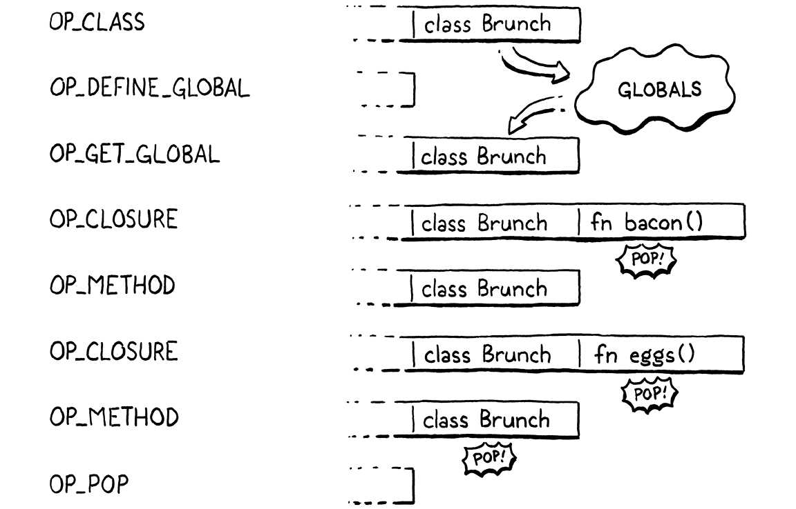
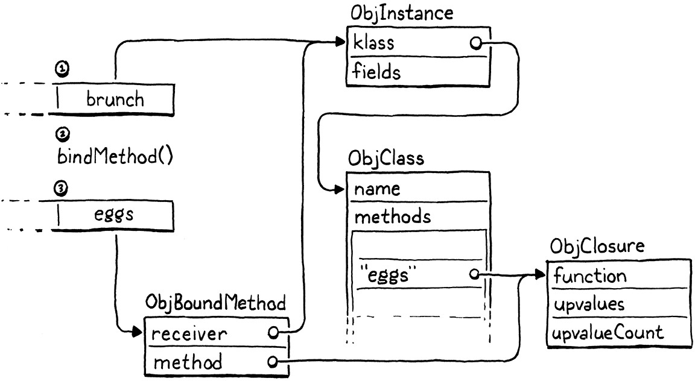
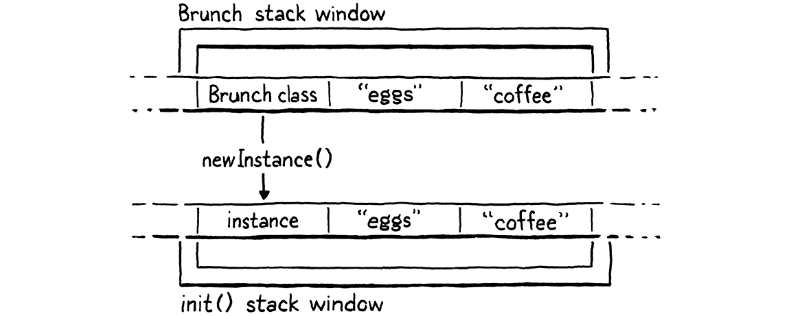

# 方法和初始化器

> 当你在舞池里时，除了跳舞之外别无他法。
> 
> -- Umberto Eco,*The Mysterious Flame of Queen Loana*

是时候让虚拟机通过行为将其新生对象带入生活。这意味着方法和方法调用。而且，由于它们是一种特殊的方法，所以初始化器也是。

所有这些都是我们之前的 jlox 解释器所熟悉的领域。第二次旅行的新内容是我们将实现的一项重要优化，以使方法调用的速度比基准性能快七倍以上。但在我们获得乐趣之前，必须让基本的东西发挥作用。

## 28.1 方法声明

我们不能在有方法调用之前优化方法调用，没有方法调用就不能调用方法，所以将从声明开始。

### 28.1.1 表示方法

我们通常从编译器开始，但这次我们先敲掉对象模型。clox 中方法的运行时表示类似于 jlox。每个类都存储一个方法哈希表。键是方法名称，每个值都是方法主体的 ObjClosure。

```c
typedef struct {
  Obj obj;
  ObjString* name;
  Table methods;
} ObjClass;
// object.h, in struct ObjClass
```

一个全新的类以一个空的方法表开始。

```c
  klass->name = name; 
  initTable(&klass->methods);
  return klass;
// object.c, in newClass()
```

ObjClass 结构拥有这个表的内存，所以当内存管理器释放一个类时，这个表也应该被释放。

```c
    case OBJ_CLASS: {
      ObjClass* klass = (ObjClass*)object;
      freeTable(&klass->methods);
      FREE(ObjClass, object);
// memory.c, in freeObject()
```

说到内存管理器，GC 需要通过类跟踪到方法表中。如果一个类仍然可以访问（可能通过某个实例），那么它的所有方法当然也需要坚持下去。

```c
      markObject((Obj*)klass->name);
      markTable(&klass->methods);
      break;
// memory.c, in blackenObject()
```

我们使用现有`markTable()`函数，它跟踪每个表条目中的键字符串和值。

来自 jlox 的存储类的方法非常熟悉。不同的部分是如何填充该表。我们之前的解释器可以访问类声明的整个 AST 节点及其包含的所有方法。在运行时，解释器只是遍历声明列表。

现在，编译器想要分流到运行时的每条信息都必须通过一系列扁平的字节码指令的接口。我们如何获取可以包含任意大的方法集的类声明，并将其表示为字节码？让我们跳到编译器并找出答案。

### 28.1.2 编译方法声明

上一章给我们留下了一个编译器, 它可以解析类但只允许空主体。现在我们插入一点代码来编译大括号之间的一系列方法声明。

```c
  consume(TOKEN_LEFT_BRACE, "Expect '{' before class body.");
  while (!check(TOKEN_RIGHT_BRACE) && !check(TOKEN_EOF)) {
    method();
  }
  consume(TOKEN_RIGHT_BRACE, "Expect '}' after class body.");
// compiler.c, in classDeclaration()
```

Lox 没有字段声明，因此类主体末尾右大括号之前的任何内容都必须是方法。当我们遇到最后一个大括号} 或到达文件末尾时，将停止编译方法。如果用户不小心忘记了右大括号，后一项检查可确保编译器不会陷入无限循环。

编译类声明的棘手部分是一个类可以声明任意数量的方法。运行时需要以某种方式查找并绑定所有这些。将很多内容打包成一条`OP_CLASS`指令。相反，我们为类声明生成的字节码会将过程拆分为*一系列*指令。编译器已经发出一条`OP_CLASS`指令来创建一个新的空 ObjClass 对象。然后它发出指令将该类存储在一个变量中，并带有它的名称。

> 我们对闭包做了类似的事情。该`OP_CLOSURE`指令需要知道每个捕获的上值的类型和索引。我们在`OP_CLOSURE`主指令之后使用一系列伪指令对其进行编码——基本上是可变数量的操作数。VM 在解释`OP_CLOSURE`指令时立即处理所有这些额外的字节。
> 
> 这里我们的方法有点不同，因为从 VM 的角度来看，每条定义方法的指令都是单独的独立操作。两种方法都行得通。可变大小的伪指令可能稍微快一些，但是类声明很少出现在热循环中，所以这无关紧要。

现在，对于每个方法声明，都会发出一条新`OP_METHOD`指令，向该类添加一个方法。当所有的`OP_METHOD`指令都执行完后，我们就得到了一个完整的类。当用户将类声明视为单个原子操作时，VM 将其实现为一系列突变。

要定义一个新方法，VM 需要三样东西：

1. 方法的名称。

2. 方法体的闭包。

3. 将方法绑定到的类。

我们将逐步编写编译器代码，看看它们是如何进入运行时的，从这里开始：

```c
static void method() {
  consume(TOKEN_IDENTIFIER, "Expect method name.");
  uint8_t constant = identifierConstant(&parser.previous);
  emitBytes(OP_METHOD, constant);
}
// compiler.c, add after function()
```

与`OP_GET_PROPERTY`其他在运行时需要名称的指令一样，编译器将方法名称token的词素添加到常量表中，取回表索引。然后我们发出一条`OP_METHOD`以该索引为操作数的指令。就是这个名字。接下来是方法体：

```c
  uint8_t constant = identifierConstant(&parser.previous);

  FunctionType type = TYPE_FUNCTION;
  function(type);
  emitBytes(OP_METHOD, constant);
// compiler.c, in method()
```

我们使用用于编译函数声明的相同辅助函数 `function()`。该工具函数函数编译后续参数列表和函数体。然后它发出代码以创建一个 ObjClosure 并将其留在栈顶部。在运行时，VM 会在那里找到闭包。

最后是将方法绑定到的类。VM 在哪里可以找到它？不幸的是，当我们到达`OP_METHOD`指令时，我们不知道它在哪里。如果用户在本地范围内声明该类，它可能在堆栈上。但是顶级类声明会在全局变量表中定义 ObjClass 。

> 如果 Lox 支持仅在顶层声明类，则 VM 可以假设可以通过直接从全局变量表中查找来找到任何类。然而，因为我们支持本地类，所以我们也需要处理这种情况。

不要怕。编译器确实知道类的*名称*。我们可以在消费它的token后立即捕获它。

```c
  consume(TOKEN_IDENTIFIER, "Expect class name.");
  Token className = parser.previous;
  uint8_t nameConstant = identifierConstant(&parser.previous);
// compiler.c, in classDeclaration()
```

而且我们知道，没有其他具有该名称的声明可能遮蔽该类。所以我们做了简单的修复。在我们开始绑定方法之前，会发出将类加载回栈顶部所需的任何代码。

```c
  defineVariable(nameConstant);

  namedVariable(className, false);
  consume(TOKEN_LEFT_BRACE, "Expect '{' before class body.");
// compiler.c, in classDeclaration()
```

在编译类主体之前，我们调用`namedVariable()`.该辅助函数生成代码以将具有给定名称的变量加载到栈中。然后我们编译方法。

> 在调用 defineVariable() 之前pop class，因此 调用namedVariable() 将其直接加载回栈似乎很愚蠢。为什么不直接把它放在栈上呢？我们可以，但在[下一章](http://craftinginterpreters.com/superclasses.html)中，我们将在这两个调用之间插入代码以支持继承。到那时，如果类不在栈上，事情会更简单。

这意味着当我们执行每条`OP_METHOD`指令时，栈的顶部是方法的闭包，类就在它的下方。一旦到达方法的末尾，我们就不再需要该类并告诉 VM 将其从堆栈中弹出。

```c
  consume(TOKEN_RIGHT_BRACE, "Expect '}' after class body.");
  emitByte(OP_POP);
}
// compiler.c, in classDeclaration()
```

将所有这些放在一起，这是一个抛给编译器的示例类声明：

```c
class Brunch {
  bacon() {}
  eggs() {}
}
```

鉴于此，以下是编译器生成的内容以及这些指令在运行时如何影响堆栈：



剩下的就是为该新`OP_METHOD`指令实现运行时。

### 28.1.3 执行方法声明

首先我们定义操作码。

```c
  OP_CLASS,
  OP_METHOD
} OpCode;
// chunk.h, in enum OpCode
```

我们像其他具有字符串常量操作数的指令一样反汇编它。

```c
    case OP_CLASS:
      return constantInstruction("OP_CLASS", chunk, offset);
    case OP_METHOD:
      return constantInstruction("OP_METHOD", chunk, offset);
    default:
// debug.c, in disassembleInstruction()
```

在解释器中，我们也添加了一个新case。

```c
        break;
      case OP_METHOD:
        defineMethod(READ_STRING());
        break;
    }
// vm.c, in run()
```

在那里，我们从常量表中读取方法名称并将其传递到此处：

```c
static void defineMethod(ObjString* name) {
  Value method = peek(0);
  ObjClass* klass = AS_CLASS(peek(1));
  tableSet(&klass->methods, name, method);
  pop();
}
// vm.c, add after closeUpvalues()
```

方法闭包位于栈顶，在它将绑定到的类之上。我们读取这两个堆栈槽并将闭包存储在类的方法表中。然后我们弹出闭包，因为我们已经完成了它。

请注意，我们不对闭包或类对象进行任何运行时类型检查。该`AS_CLASS()`调用是安全的，因为编译器本身生成了导致该类位于该堆栈槽中的代码。VM信任自己的编译器。

> VM 相信它执行的指令是有效的，因为将代码提供给字节码解释器的*唯一*方法是通过 clox 自己的编译器。许多字节码虚拟机，如 JVM 和 CPython，支持执行单独编译的字节码。这导致了一个不同的安全故事。恶意制作的字节码可能会使 VM 崩溃或更糟。
> 
> 为了防止这种情况，JVM 在执行任何加载的代码之前执行字节码验证。CPython 表示，由用户来确保他们运行的任何字节码都是安全的。

在完成一系列`OP_METHOD`指令并`OP_POP`弹出类后，我们将拥有一个带有填充好方法表的类，可以开始做事了。下一步是将这些方法撤回并使用它们。

## 28.2 方法引用

大多数时候，方法被访问并立即被调用，导致这种熟悉的语法：

```js
instance.method(argument);
```

但请记住，在 Lox 和其他一些语言中，这两个步骤是不同的并且可以分开。

```js
var closure = instance.method;
closure(argument);
```

既然用户*可以*把操作分开，我们就得分开实现。第一步是使用现有的点属性语法来访问实例类上定义的方法。那应该返回某种对象，然后用户可以像函数一样调用该对象。

显而易见的方法是在类的方法表中查找方法并返回与该名称关联的 ObjClosure。但我们还需要记住，当您访问一个方法时，它`this`会绑定到访问该方法的实例。这是[我们向 jlox 添加方法时](http://craftinginterpreters.com/classes.html#methods-on-classes)的示例：

```js
class Person {
  sayName() {
    print this.name;
  }
}

var jane = Person();
jane.name = "Jane";

var method = jane.sayName;
method(); // ?
```

这应该打印“Jane”，因此以`.sayName`某种方式返回的对象需要记住稍后调用时访问它的实例。在 jlox 中，我们使用解释器现有的堆分配环境类来实现该“记忆 (memory)”，该类处理所有变量存储。

字节码 VM 有一个更复杂的存储状态的架构。[局部变量和临时变量](http://craftinginterpreters.com/local-variables.html#representing-local-variables)在栈上，[全局变量](http://craftinginterpreters.com/global-variables.html#variable-declarations)在哈希表中，闭包中的变量使用[upvalues](http://craftinginterpreters.com/closures.html#upvalues)。这需要一个更复杂的解决方案来跟踪 clox 中的方法接收者，以及一个新的运行时类型。

### 28.2.1 绑定方法 (Bound methods)

当用户执行方法访问时，将找到该方法的闭包并将其包装在一个新的“绑定方法 bound method”对象中，该对象跟踪从中访问该方法的实例。这个绑定对象以后可以像函数一样被调用。调用时，VM 将执行一些恶作剧以绑定`this`到方法主体内的接收器。

> 我从 CPython 中取名为“绑定方法”。Python 在这里的行为类似于 Lox，我使用它的实现来获得灵感。

这是新的对象类型：

```c
} ObjInstance;

typedef struct {
  Obj obj;
  Value receiver;
  ObjClosure* method;
} ObjBoundMethod;

ObjClass* newClass(ObjString* name);
// object.h, add after struct ObjInstance
```

它将接收器和方法闭包包装在一起。即使只能在 ObjInstances 上调用方法，接收者的类型也是 Value。由于 VM 不关心它有什么样的接收器，使用 Value 意味着不必在指针传递给更通用的函数时继续将指针转换回 Value。

新结构意味着您现在已经习惯的常用样板。对象类型枚举中的新案例：

```c
typedef enum {
  OBJ_BOUND_METHOD,
  OBJ_CLASS,
// object.h, in enum ObjType
```

检查值类型的宏：

```c
#define OBJ_TYPE(value)        (AS_OBJ(value)->type)

#define IS_BOUND_METHOD(value) isObjType(value, OBJ_BOUND_METHOD)
#define IS_CLASS(value)        isObjType(value, OBJ_CLASS)
// object.h
```

另一个将值转换为 ObjBoundMethod 指针的宏：

```c
#define IS_STRING(value)       isObjType(value, OBJ_STRING)

#define AS_BOUND_METHOD(value) ((ObjBoundMethod*)AS_OBJ(value))
#define AS_CLASS(value)        ((ObjClass*)AS_OBJ(value))
// object.h
```

创建新 ObjBoundMethod 的函数：

```c
} ObjBoundMethod;

ObjBoundMethod* newBoundMethod(Value receiver,
                               ObjClosure* method);
ObjClass* newClass(ObjString* name);
// object.h, add after struct ObjBoundMethod
```

以及该函数的实现：

```c
ObjBoundMethod* newBoundMethod(Value receiver,
                               ObjClosure* method) {
  ObjBoundMethod* bound = ALLOCATE_OBJ(ObjBoundMethod,
                                       OBJ_BOUND_METHOD);
  bound->receiver = receiver;
  bound->method = method;
  return bound;
}
// object.c, add after allocateObject()
```

类似构造函数的函数只是存储给定的闭包和接收者。当不再需要绑定方法时，我们释放它。

```c
  switch (object->type) {
    case OBJ_BOUND_METHOD:
      FREE(ObjBoundMethod, object);
      break;
    case OBJ_CLASS: {
// memory.c, in freeObject()
```

绑定方法有几个引用，但它不*拥有*它们，所以它只释放自己。但是，这些引用确实会被垃圾收集器跟踪。

```c
  switch (object->type) {
    case OBJ_BOUND_METHOD: {
      ObjBoundMethod* bound = (ObjBoundMethod*)object;
      markValue(bound->receiver);
      markObject((Obj*)bound->method);
      break;
    }
    case OBJ_CLASS: {
// memory.c, in blackenObject()
```

这确保方法的句柄将接收者保留在内存中，以便您稍后调用`this`句柄时仍然可以找到对象。我们还跟踪方法闭包。

> 跟踪方法闭包并不是真正必要的。接收者是一个 ObjInstance，它有一个指向它的 ObjClass 的指针，ObjClass 有一个包含所有方法的表。但是让 ObjBoundMethod 依赖于它以某种模糊的方式让我感到可疑。

所有对象支持的最后一个操作是打印。

```c
  switch (OBJ_TYPE(value)) {
    case OBJ_BOUND_METHOD:
      printFunction(AS_BOUND_METHOD(value)->method->function);
      break;
    case OBJ_CLASS:
// object.c, in printObject()
```

绑定方法的打印方式与函数完全相同。从用户的角度来看，绑定方法*是*一个函数。这是一个他们可以调用的对象。我们不会公开 VM 使用不同的对象类型实现绑定方法。


戴上你的派对帽，因为我们刚刚达到了一个小里程碑。ObjBoundMethod 是添加到 clox 的最后一个运行时类型。您已经编写了 last`IS_`和`AS_`宏。我们距离本书的最后几章只有几章了，我们离一个完整的 VM 越来越近了。

### 28.2.2 方法访问

让我们的新对象类型做点什么。使用在上一章中实现的相同“点”属性语法访问方法。编译器已经解析了正确的表达式并为它们发出`OP_GET_PROPERTY`指令。我们需要做的唯一改变是在运行时。

当执行属性访问指令时，实例位于栈顶部。该指令的工作是查找具有给定名称的字段或方法，并将栈的顶部替换为访问的属性。

解释器已经处理字段，所以我们只需`OP_GET_PROPERTY`用另一个部分扩展case。

```c
          pop(); // Instance.
          push(value);
          break;
        }

        if (!bindMethod(instance->klass, name)) {
          return INTERPRET_RUNTIME_ERROR;
        }
        break;
      }
// vm.c, in run(), replace 2 lines
```

我们在代码之后插入它以查找接收器实例上的字段。字段优先且遮蔽方法，所以首先寻找一个字段。如果实例没有具有给定属性名称的字段，则该名称可能引用一个方法。

我们获取实例的类并将其传递给新的`bindMethod()`助手。如果该函数找到一个方法，它会将方法放入栈并返回`true`。否则它返回`false`以指示找不到具有该名称的方法。由于名称也不是一个字段，这意味着我们有一个运行时错误，它会中止解释器。

这是好东西：

```c
static bool bindMethod(ObjClass* klass, ObjString* name) {
  Value method;
  if (!tableGet(&klass->methods, name, &method)) {
    runtimeError("Undefined property '%s'.", name->chars);
    return false;
  }

  ObjBoundMethod* bound = newBoundMethod(peek(0),
                                         AS_CLOSURE(method));
  pop();
  push(OBJ_VAL(bound));
  return true;
}
// vm.c, add after callValue()
```

首先，我们在类的方法表中查找具有给定名称的方法。如果找不到，会报告运行时错误并退出。否则，获取该方法并将其包装在新的 ObjBoundMethod 中。我们从栈顶部获取接收器。最后，我们弹出实例并用绑定方法替换栈顶。

例如：

```c
class Brunch {
  eggs() {}
}

var brunch = Brunch();
var eggs = brunch.eggs;
```

以下是 VM 执行表达式`bindMethod()`调用`brunch.eggs`时发生的情况：



引擎盖下有很多机器，但从用户的角度来看，他们只是获得了一个可以调用的函数。

### 28.2.3 调用方法

用户可以在类上声明方法，在实例上访问它们，并将绑定的方法放到栈上。他们只是不能对那些绑定的方法对象做任何有用的事情。缺少的操作是调用它们。调用在`callValue()`中实现，因此我们在其中为新对象类型添加一个case。

> 绑定方法*是*一流的值，因此他们可以将其存储在变量中，将其传递给函数，或者用它做“value”-y 东西。

```c
    switch (OBJ_TYPE(callee)) {
      case OBJ_BOUND_METHOD: {
        ObjBoundMethod* bound = AS_BOUND_METHOD(callee);
        return call(bound->method, argCount);
      }
      case OBJ_CLASS: {
// vm.c, in callValue()
```

将原始闭包从 ObjBoundMethod 拉回，并使用现有的`call()`辅助函数通过将其 CallFrame push到调用栈来开始对该闭包的调用。这就是能够运行此 Lox 程序所需的全部：

```js
class Scone {
  topping(first, second) {
    print "scone with " + first + " and " + second;
  }
}

var scone = Scone();
scone.topping("berries", "cream");
```

这是三个大步骤。我们可以声明、访问和调用方法。但有些东西丢失了。我们不厌其烦地将方法闭包包装在一个绑定接收者的对象中，但是当我们调用该方法时，我们根本没有使用那个接收者。

## 28.3 This

绑定方法需要保留接收者的原因是它可以在方法体内访问。Lox 通过`this`表达式公开方法的接收者。是时候使用一些新语法了。词法分析器已经将`this`其视为一种特殊的标记类型，因此第一步是将该token连接到解析表中。

```c
  [TOKEN_SUPER]         = {NULL,     NULL,   PREC_NONE},
  [TOKEN_THIS]          = {this_,    NULL,   PREC_NONE},
  [TOKEN_TRUE]          = {literal,  NULL,   PREC_NONE},
// compiler.c, replace 1 line 
```

> 解析器函数名称末尾的下划线是因为`this`是 C++ 中的保留字，我们支持将 clox 编译为 C++。

当解析器遇到`this` 前缀位置时，它会分派到一个新的解析器函数。

```c
static void this_(bool canAssign) {
  variable(false);
} 
// compiler.c, add after variable()
```

我们将在 clox 中应用在 jlox 中使用的相同实现`this`技术。我们将`this`其视为一个词法作用域的局部变量，其值被神奇地初始化。像局部变量一样编译它意味着我们可以免费获得很多行为。特别是，引用方法中的闭包`this`会做正确的事情并在上值中捕获接收者。

当解析函数被调用时，`this`  token 刚刚被消费并存储为先前的 token。我们调用现有的`variable()`函数，该函数将标识符表达式编译为变量访问。它采用单个布尔参数来确定编译器是否应查找后续`=`运算符并解析设置器。您不能赋值给`this`，所以传递`false` 以防止此现象。

该`variable()`函数不关心`this`是否具有自己的token类型并且不是标识符。很高兴地将词素“this”视为一个变量名，然后使用现有的作用域解析机制查找它。现在，该查找将失败，因为从未声明过名称为“this”的变量。是时候考虑接收器应该存放在内存中的什么位置了。

至少在它们被闭包捕获之前，clox 将每个局部变量存储在 VM 的栈中。编译器会跟踪函数栈窗口中的哪些槽位属于哪些局部变量。如果您还记得，编译器通过声明一个名称为空字符串的局部变量来预留栈槽零。

对于函数调用，该槽最终保存被调用的函数。由于插槽没有名称，函数体永远不会访问它。你可以猜到这是怎么回事。对于*方法*调用，我们可以重新利用该插槽来存储接收器。槽零将存储`this`绑定到的实例。为了编译`this`表达式，编译器只需要为该局部变量提供正确的名称。

```c
  local->isCaptured = false;
  if (type != TYPE_FUNCTION) {
    local->name.start = "this";
    local->name.length = 4;
  } else {
    local->name.start = "";
    local->name.length = 0;
  }
}
// compiler.c, in initCompiler(), replace 2 lines
```

我们只想对方法执行此操作。函数声明没有`this`.而且，事实上，它们*不能*声明一个名为“this”的变量，因此如果您在函数声明中编写一个`this`表达式，而该函数声明本身在一个方法中，则`this`正确地解析为外部方法的接收者。

```c
class Nested {
  method() {
    fun function() {
      print this;
    }

    function();
  }
}

Nested().method();
```

该程序应打印“嵌套实例”。为了决定给局部槽 0 取什么名字，编译器需要知道它是在编译一个函数还是方法声明，所以我们在 FunctionType 枚举中添加一个新的 case 来区分方法。

```c
  TYPE_FUNCTION,
  TYPE_METHOD,
  TYPE_SCRIPT
// compiler.c, in enum FunctionType
```

当我们编译一个方法(method)时，我们使用那个类型。

```c
  uint8_t constant = identifierConstant(&parser.previous);

  FunctionType type = TYPE_METHOD;
  function(type);
// compiler.c, in method(), replace 1 line
```

现在我们可以正确编译对特殊“this”变量的引用，编译器将发出正确的`OP_GET_LOCAL`指令来访问它。闭包甚至可以捕获`this`接收者并将其存储在上值中。很酷。

除了在运行时，接收器实际上不在*槽*零中。解释器还没有遵守协议。这是修复：

```c
      case OBJ_BOUND_METHOD: {
        ObjBoundMethod* bound = AS_BOUND_METHOD(callee);
        vm.stackTop[-argCount - 1] = bound->receiver;
        return call(bound->method, argCount);
      }
// vm.c, in callValue()
```

当一个方法被调用时，栈顶包含所有的参数，然后就在这些参数下面是被调用方法的闭包。这就是新 CallFrame 中的零槽所在的位置。这行代码将接收器插入该插槽。例如，给定这样的方法调用：

```c
scone.topping("berries", "cream");
```

我们像这样计算存储接收器的插槽：


`-argCount`跳过参数且`- 1`调整`stackTop`刚好指向超过最后使用的栈槽 。

### 28.3.1 误用this

我们的虚拟机现在支持用户*正确*使用`this`，但我们还需要确保它能正确处理用户误用`this`。`this`Lox 说表达式出现在方法主体之外是一个编译错误。这两个错误的用法应该被编译器捕获：

```c
print this; // At top level.

fun notMethod() {
  print this; // In a function.
}
```

那么编译器如何知道它是否在方法内部呢？显而易见的答案是查看当前 Compiler 的 FunctionType。我们只是在那里添加了一个枚举案例来专门处理方法。但是，这不会像前面的示例那样正确地处理代码，在这个示例中，您在一个函数中，而这个函数本身嵌套在一个方法中。

我们可以尝试解析“this”，如果在任何周围的词法范围内都找不到它，则报告错误。这可行，但需要我们对一堆代码进行打乱，因为现在如果没有找到声明，用于解析变量的代码会隐式地将其视为全局访问。

在下一章中，我们将需要有关最近封闭类的信息。如果我们有，我们可以在这里使用它来确定我们是否在一个方法中。所以我们不妨让我们未来的自己的生活更轻松一些，现在就把机器安装到位。

```c
Compiler* current = NULL;
ClassCompiler* currentClass = NULL;  //<<

static Chunk* currentChunk() {
// compiler.c, add after variable current
```

这个模块变量指向一个结构，表示当前正在编译的最内层类。新类型如下所示：

```c
} Compiler;

typedef struct ClassCompiler {
  struct ClassCompiler* enclosing;
} ClassCompiler;

Parser parser;
// compiler.c, add after struct Compiler
```

现在我们只存储一个指向封闭类的 ClassCompiler 的指针，如果有的话。将类声明嵌套在其他类的方法中并不常见，但 Lox 支持它。就像 Compiler 结构一样，这意味着 ClassCompiler 形成一个链表，从当前最内层的类通过所有封闭类编译出来。

如果我们根本不在任何类声明中，则模块变量`currentClass`是`NULL`.当编译器开始编译一个类时，它会将一个新的 ClassCompiler 压入该隐式链接栈。

```c
  defineVariable(nameConstant);

  ClassCompiler classCompiler;
  classCompiler.enclosing = currentClass;
  currentClass = &classCompiler;

  namedVariable(className, false);
// compiler.c, in classDeclaration()
```

ClassCompiler 结构的内存就在 C 堆栈上，这是我们通过使用递归下降编写编译器获得的便利功能。在类主体的末尾，我们将该编译器从堆栈中弹出并恢复封闭的编译器。

```c
  emitByte(OP_POP);

  currentClass = currentClass->enclosing;
}
// compiler.c, in classDeclaration()
```

当最外层的类主体结束时，`enclosing`将是`NULL`，因此它重置`currentClass`为`NULL`。因此，要查看我们是否在一个类中——因此在一个方法中——我们只需检查该模块变量。

```c
static void this_(bool canAssign) {
  if (currentClass == NULL) {
    error("Can't use 'this' outside of a class.");
    return;
  }

  variable(false);
compiler.c, in this_()
```

这样一来，`this`正确地禁止在class之外。现在我们的方法真的感觉像是面向对象意义上的方法。访问接收器可以让它们影响您调用该方法的实例。我们终于做到了！

## 28.4 实例初始化器

面向对象语言将状态和行为联系在一起的原因——范式的核心原则之一——是为了确保对象始终处于有效、有意义的状态。当接触对象状态的唯一方法是通过它的方法时，这些方法可以确保没有任何问题。但这假定对象*已经*处于适当的状态。当它第一次创建时呢？

> 当然，Lox 确实允许外部代码直接访问和修改实例的字段，而无需通过其方法。这与 Ruby 和 Smalltalk 不同，它们将状态完全封装在对象中。唉，我们的玩具脚本语言并不是那么有原则。

面向对象的语言确保通过构造函数正确设置全新的对象，构造函数既产生新实例又初始化其状态。在 Lox 中，运行时分配新的原始实例，并且一个类可以声明一个初始化程序来设置任何字段。初始化器的工作方式与普通方法大体相同，但有一些调整：

1. 每当创建类的实例时，运行时都会自动调用初始化方法。

2. 构造实例的调用者总是在初始化器完成后取回实例，而不管初始化器函数本身返回什么。初始化方法不需要显式返回`this`。

3. 事实上，一个初始化器被*禁止*返回任何值，因为这个值无论如何都不会被看到。

> 就好像初始化程序隐式包装在这样的代码包中：
> 
> ```js
> fun create(klass) {
>   var obj = newInstance(klass);
>   obj.init();
>   return obj;
> }
> ```

> 请注意返回的值是如何`init()`被丢弃的。

现在我们支持方法，要添加初始化器，我们只需要实现这三个特殊规则。我们按顺序走。

### 28.4.1 调用初始化程序

首先，自动调用`init()`新实例：

```c
        vm.stackTop[-argCount - 1] = OBJ_VAL(newInstance(klass));
        Value initializer;
        if (tableGet(&klass->methods, vm.initString,
                     &initializer)) {
          return call(AS_CLOSURE(initializer), argCount);
        }
        return true;
// vm.c, in callValue()
```

在运行时分配新实例后，我们在类上寻找`init()`方法。如果我们找到一个，我们会发起一个调用。这会为初始化程序的闭包推送一个新的 CallFrame。假设我们运行这个程序：

```js
class Brunch {
  init(food, drink) {}
}

Brunch("eggs", "coffee");
```

当 VM 执行对 的调用时`Brunch()`，它是这样的：



当我们调用它时传递给类的任何参数仍然位于实例上方的堆栈中。`init()`方法新的 CallFrame 共享该栈窗口，因此这些参数隐式地转发给初始化程序。

Lox 不需要类来定义初始化程序。如果省略，运行时仅返回新的未初始化实例。但是，如果没有`init()`方法，那么在创建实例时向类传递参数就没有任何意义。我们认为这是一个错误。

```c
          return call(AS_CLOSURE(initializer), argCount);
        } else if (argCount != 0) {
          runtimeError("Expected 0 arguments but got %d.",
                       argCount);
          return false;
        }
// vm.c, in callValue()
```

当类*确实*提供了初始化器时，我们还需要确保传递的参数数量与初始化器的数量相匹配。幸运的是，`call()`助手已经为我们做了这件事。

要调用初始化程序，运行时会按名称查找`init()`方法。我们希望它很快，因为它会在每次构造实例时发生。这意味着最好利用我们已经实现的字符串intern。为此，VM 为“init”创建了一个 ObjString 并重用它。该字符串就在 VM 结构中。

```c
  Table strings;
  ObjString* initString;
  ObjUpvalue* openUpvalues;
// vm.h, in struct VM 
```

我们在 VM 启动时创建并保留字符串。

```c
  initTable(&vm.strings);

  vm.initString = copyString("init", 4);

  defineNative("clock", clockNative);
// vm.c, in initVM()
```

我们希望它保留下来，所以 GC 认为它是一个根。

```c
  markCompilerRoots();
  markObject((Obj*)vm.initString);
}
// memory.c, in markRoots()
```

仔细看。看到任何等待发生的错误吗？不？这是一个微妙的。垃圾收集器现在读取`vm.initString`.该字段是根据调用的结果初始化的`copyString()`。但是复制字符串会分配内存，这会触发 GC。如果收集器在错误的时间运行，它会在初始化之前读取`vm.initString`。所以，首先我们将字段归零。

```c
  initTable(&vm.strings);

  vm.initString = NULL;
  vm.initString = copyString("init", 4);

// vm.c, in initVM()
```

我们在 VM 关闭时清除指针，因为下一行将释放它。

```c
  freeTable(&vm.strings);
  vm.initString = NULL;
  freeObjects();
// vm.c, in freeVM()
```

好的，这让我们可以调用初始化程序。

### 28.4.2 初始化器返回值

下一步是确保使用初始化器构造类的实例总是返回新实例，而不是`nil`或初始化器返回的任意内容。现在，如果一个类定义了一个初始化器，那么当构造一个实例时，VM 会将对该初始化器的调用推送到 CallFrame 栈上。然后它就继续卡车运输。

每当初始化方法返回时，用户对类创建实例的调用就会完成，并且会将初始化方法返回的值留在栈中。这意味着除非用户可以将`return this;`放在初始化程序的末尾，否则不会返回任何实例。这不是很有用。

为了解决这个问题，每当前端编译一个初始化方法时，它都会在主体的末尾发出不同的字节码以从该方法返回`this`，而不是通常的大多数函数返回隐式`nil`。为了做到*这一点*，编译器需要真正知道它何时编译初始化程序。我们通过检查我们正在编译的方法的名称是否为“init”来检测到这一点。

```c
  FunctionType type = TYPE_METHOD;
  if (parser.previous.length == 4 &&
      memcmp(parser.previous.start, "init", 4) == 0) {
    type = TYPE_INITIALIZER;
  }

  function(type);
// compiler.c, in method()
```

我们定义了一个新的函数类型来区分初始化器和其他方法。

```c
  TYPE_FUNCTION,
  TYPE_INITIALIZER,
  TYPE_METHOD,
// compiler.c, in enum FunctionType
```

每当编译器在主体末尾发出隐式返回时，我们检查类型以决定是否插入特定于初始化程序的行为。

```c
static void emitReturn() {
  if (current->type == TYPE_INITIALIZER) {
    emitBytes(OP_GET_LOCAL, 0);
  } else {
    emitByte(OP_NIL);
  }

  emitByte(OP_RETURN);
// compiler.c, in emitReturn(), replace 1 line
```

在初始化器中，我们不是在返回之前压入`nil`入栈，而是加载包含实例的槽零。在编译没有值的`return`语句时也会调用`emitReturn()`函数，因此这也可以正确处理用户在初始化程序中提前返回的情况。

### 28.4.3 初始函数错误返回

最后一步，也就是我们初始化器特殊功能列表中的最后一项，是让尝试从初始化器返回任何其他内容成为错误。既然编译器跟踪了方法类型，这就很简单了。

```c
  if (match(TOKEN_SEMICOLON)) {
    emitReturn();
  } else {
    if (current->type == TYPE_INITIALIZER) {
      error("Can't return a value from an initializer.");
    }

    expression();
// compiler.c, in returnStatement()
```

如果初始化器中的`return`语句有值，我们会报告错误。我们仍然继续并在之后编译该值，这样编译器就不会被尾随表达式迷惑并报告一堆级联错误。

除了我们[很快就会](http://craftinginterpreters.com/superclasses.html)谈到的继承之外，我们现在在 clox 中有一个功能相当齐全的类系统。

```js
class CoffeeMaker {
  init(coffee) {
    this.coffee = coffee;
  }

  brew() {
    print "Enjoy your cup of " + this.coffee;

    // No reusing the grounds!
    this.coffee = nil;
  }
}

var maker = CoffeeMaker("coffee and chicory");
maker.brew();
```

非常适合适合旧软盘的 C 程序。

> 我承认“软盘”可能不再是当代程序员有用的大小参考。也许我应该说“几条推文”之类的。

## 28.5 优化调用

我们的 VM 正确地实现了方法调用和初始化程序的语言语义。我们可以在这里停下来。但我们从头开始构建 Lox 的完整第二个实现的主要原因是比我们的旧 Java 解释器执行得更快。现在，即使在 clox 中，方法调用也很慢。

Lox 的语义将方法调用定义为两个操作——访问方法然后调用结果。我们的 VM 必须支持将这些作为单独的操作，因为用户*可以*将它们分开。您可以在不调用方法的情况下访问它，然后稍后调用绑定的方法。到目前为止，我们实现的一切都不是不必要的。

但是*始终*将它们作为单独的操作来执行会产生巨大的成本。每次 Lox 程序访问和调用方法时，运行时堆都会分配一个新的 ObjBoundMethod，初始化其字段，然后将它们拉回。稍后，GC 必须花时间释放所有这些临时绑定方法。

大多数时候，Lox 程序访问一个方法然后立即调用它。绑定方法由一个字节码指令创建，然后由下一个字节码指令使用。事实上，它是如此直接，以至于编译器甚至可以从文本上*看到*它正在发生——一个带点的属性访问后跟一个左括号很可能是一个方法调用。

由于我们可以在编译时识别这对操作，因此我们有机会发出一条新的特殊指令来执行优化的方法调用。

我们从编译   点属性表达式的函数开始。

> 如果您花足够的时间观察字节码 VM 的运行，您会发现它经常一个接一个地执行同一系列的字节码指令。**一种经典的优化技术是定义一个称为超级**指令的新单指令，将这些指令融合为一个与整个序列具有相同行为的指令。
> 
> 字节码解释器中最大的性能消耗之一是解码和分派每条指令的开销。将几条指令融合到一条指令中可以消除其中的一些。
> 
> 挑战在于确定*哪些*指令序列足够普遍以从该优化中获益。每个新的超级指令都声明了一个供自己使用的操作码，而且只有这么多的操作码可以使用。添加太多，您将需要更大的操作码编码，这会增加代码大小并使*所有*指令的解码速度变慢。

```c
  if (canAssign && match(TOKEN_EQUAL)) {
    expression();
    emitBytes(OP_SET_PROPERTY, name);
  } else if (match(TOKEN_LEFT_PAREN)) {
    uint8_t argCount = argumentList();
    emitBytes(OP_INVOKE, name);
    emitByte(argCount);
  } else {
// compiler.c, in dot()
```

编译器解析属性名称后，我们寻找左括号。如果我们匹配一个，我们切换到一个新的代码路径。在那里，我们像编译调用表达式时一样编译参数列表。然后我们发出一条新`OP_INVOKE`指令。它需要两个操作数：

1. 属性名称在常量表中的索引。

2. 传递给方法的参数数量。

换句话说，这条单条指令按顺序组合了它所替换`OP_GET_PROPERTY`的指令的操作数。`OP_CALL`它实际上是这两个指令的融合。让我们定义它。

```c
  OP_CALL,
  OP_INVOKE,
  OP_CLOSURE,
// chunk.h, in enum OpCode
```

并将其添加到反汇编程序中：

```c
    case OP_CALL:
      return byteInstruction("OP_CALL", chunk, offset);
    case OP_INVOKE:
      return invokeInstruction("OP_INVOKE", chunk, offset);
    case OP_CLOSURE: {
// debug.c, in disassembleInstruction()
```

这是一种新的特殊指令格式，因此需要一些自定义反汇编逻辑。

```c
static int invokeInstruction(const char* name, Chunk* chunk,
                                int offset) {
  uint8_t constant = chunk->code[offset + 1];
  uint8_t argCount = chunk->code[offset + 2];
  printf("%-16s (%d args) %4d '", name, argCount, constant);
  printValue(chunk->constants.values[constant]);
  printf("'\n");
  return offset + 3;
}
// debug.c, add after constantInstruction()
```

我们读取两个操作数，然后打印出方法名称和参数计数。在解释器的字节码调度循环中，真正的动作开始了。

```c
      }
      case OP_INVOKE: {
        ObjString* method = READ_STRING();
        int argCount = READ_BYTE();
        if (!invoke(method, argCount)) {
          return INTERPRET_RUNTIME_ERROR;
        }
        frame = &vm.frames[vm.frameCount - 1];
        break;
      }
      case OP_CLOSURE: {
// vm.c, in run()
```

大部分工作发生在 中`invoke()`，我们将进行介绍。在这里，我们从第一个操作数中查找方法名称，然后读取参数计数操作数。然后我们将繁重的工作移交`invoke()`。如果调用成功，该函数返回`true` 。和往常一样，`false`返回意味着发生了运行时错误。我们在这里检查并在灾难发生时中止解释器。

最后，假设调用成功，则堆栈上有一个新的 CallFrame，因此我们在`frame` 中刷新当前帧的缓存副本。

有趣的工作发生在这里：

```c
static bool invoke(ObjString* name, int argCount) {
  Value receiver = peek(argCount);
  ObjInstance* instance = AS_INSTANCE(receiver);
  return invokeFromClass(instance->klass, name, argCount);
}
// vm.c, add after callValue()
```

首先，我们从栈中获取接收器。传递给该方法的参数在栈的上方，因此我们可以向下查看那么多槽。然后将对象转换为实例并在其上调用方法是一件简单的事情。

这确实假设对象*是*一个实例。与`OP_GET_PROPERTY`指令一样，我们还需要处理用户错误地尝试对错误类型的值调用方法的情况。

```c
  Value receiver = peek(argCount);

  if (!IS_INSTANCE(receiver)) {
    runtimeError("Only instances have methods.");
    return false;
  }

  ObjInstance* instance = AS_INSTANCE(receiver);
// vm.c, in invoke()
```

这是一个运行时错误，所以报告并退出。否则，我们获取实例的类并跳转到另一个新的实用函数：

> 您现在可以猜到，我们将这段代码拆分到一个单独的函数中，因为我们稍后会重用它——在本例中用于`super`调用。

```c
static bool invokeFromClass(ObjClass* klass, ObjString* name,
                            int argCount) {
  Value method;
  if (!tableGet(&klass->methods, name, &method)) {
    runtimeError("Undefined property '%s'.", name->chars);
    return false;
  }
  return call(AS_CLOSURE(method), argCount);
}
// vm.c, add after callValue()
```

该函数按顺序结合了 VM 如何实现`OP_GET_PROPERTY`和`OP_CALL`指令的逻辑。首先，我们在类的方法表中按名称查找方法。如果找不到，会报告该运行时错误并退出。

否则，我们获取方法的闭包并将对它的调用push到 CallFrame 堆栈上。不需要堆分配和初始化 ObjBoundMethod。事实上，我们甚至不需要处理堆栈上的任何东西。接收器和方法参数已经在它们需要的位置。

> 这是我们使用栈槽 0 来存储接收者的一个关键原因——这就是调用者已经为方法调用组织栈的方式。高效的调用约定是字节码 VM 性能故事的重要组成部分。

如果现在启动 VM 并运行一个调用方法的小程序，您应该会看到与以前完全相同的行为。但是，如果我们的工作做得对，*性能*应该会大大提高。我写了一个小的微基准测试，可以执行一批 10,000 次方法调用。然后它测试它可以在 10 秒内执行多少批次。在我的电脑上，没有新`OP_INVOKE`指令，它通过了 1,089 个批次。有了这个新的优化，它同时完成了 8,324 个批次。速度提高了7.6 倍，这在编程语言优化方面是一个巨大的进步。

> 我们不应该*过于*自信。这种性能改进是相对于我们自己未优化的方法调用实现而言的，它非常慢。为每个方法调用进行堆分配不会赢得任何比赛。


### 28.5.1 调用字段

优化的基本信条是：“你不能破坏正确性。” 当语言实现更快地为他们提供答案时，用户会喜欢它，但前提是它是*正确*的答案。唉，我们实现更快的方法调用未能坚持这一原则：

```js
class Oops {
  init() {
    fun f() {
      print "not a method";
    }

    this.field = f;
  }
}

var oops = Oops();
oops.field();
```

最后一行看起来像一个方法调用。编译器认为它是并且尽职地为它发出一条`OP_INVOKE`指令。然而，事实并非如此。实际发生的是一个*字段*访问，它返回一个函数，然后被调用。现在，我们的 VM 没有正确执行它，而是在找不到名为“field”的方法时报告运行时错误。

> 在某些情况下，当程序有时会返回错误答案以换取运行速度明显加快或性能得到更好的限制时，用户可能会感到满意。这些都是[**蒙特卡洛算法**](https://en.wikipedia.org/wiki/Monte_Carlo_algorithm)的领域。对于某些用例，这是一个很好的权衡。
> 
> 不过，重要的是用户*选择*应用其中一种算法。我们语言的实现者不能单方面决定牺牲他们程序的正确性。

早些时候，当我们实现时`OP_GET_PROPERTY`，我们处理了字段和方法访问。要消除这个新错误，我们需要对`OP_INVOKE`.

```c
  ObjInstance* instance = AS_INSTANCE(receiver);

  Value value;
  if (tableGet(&instance->fields, name, &value)) {
    vm.stackTop[-argCount - 1] = value;
    return callValue(value, argCount);
  }

  return invokeFromClass(instance->klass, name, argCount);
// vm.c, in invoke()
```

很简单的修复。在查找实例类的方法之前，我们先查找具有相同名称的字段。如果我们找到一个字段，那么将它存储在栈中，代替接收者，*在*参数列表下。这是因为后一条指令在评估后续带括号的参数列表之前执行的`OP_GET_PROPERTY`行为。

然后我们尝试调用该字段的值，就像它希望的可调用一样。助手将`callValue()`检查值的类型并适当地调用它，或者如果字段的值不是像闭包这样的可调用类型，则报告运行时错误。

这就是使我们的优化完全安全所需的全部。不幸的是，我们确实牺牲了一点性能。但有时这就是你必须付出的代价。如果语言不允许出现一些恼人的极端情况，您偶尔会对可以进行的优化感到沮丧。但是，作为语言 的实现者，我们必须玩给定的游戏。

> 作为语言*设计者*，我们的角色是非常不同的。如果我们确实控制了语言本身，我们有时可能会选择以支持优化的方式限制或更改语言。用户想要富有表现力的语言，但他们也想要快速的实施。有时候，如果你能给他们 perf 作为回报，牺牲一点权力是好的语言设计。

我们在此处编写的代码遵循典型的优化模式：

1. 识别对性能至关重要的常见操作或操作序列。在这种情况下，它是一个方法访问，然后是一个调用。

2. 添加该模式的优化实现。那是我们的`OP_INVOKE`指令。

3. 使用一些条件逻辑来保护优化后的代码，以验证该模式是否实际应用。如果是这样，请留在快速路径上。否则，退回到更慢但更健壮的未优化行为。在这里，这意味着检查我们实际上是在调用方法而不是访问字段。

随着您的语言工作从让实现工作变得更快，您会发现自己花费越来越多的时间来寻找这样的模式并为它们添加受保护的优化。全职 VM 工程师的大部分职业生涯都在这个循环中度过。

但我们可以暂时停在这里。有了这个，clox 现在支持面向对象编程语言的大部分功能，并且具有可观的性能。

## [挑战](http://craftinginterpreters.com/methods-and-initializers.html#challenges)

1. 在哈希表查找 类的`init()`方法 是常数时间，但仍然相当慢。更快地实现一些东西。编写基准并测量性能差异。

2. 在像 Lox 这样的动态类型语言中，单个调用点可以在整个程序执行过程中调用多个类的各种方法。即便如此，在实践中，大多数情况下调用点最终会在运行期间对完全相同的类调用完全相同的方法。大多数调用实际上不是多态的，即使语言说它们可以。
   
   高级语言实现如何根据该观察进行优化？

3. 解释执行`OP_INVOKE`指令时，VM 必须进行两次哈希表查找。首先，它寻找一个可以隐藏方法的字段，只有在失败时它才会寻找方法。前一个检查很少有用——大多数字段不包含函数。但这是*必要*的，因为该语言表示使用相同的语法访问字段和方法，并且字段遮蔽方法(同名字段比方法优先级高)。
   
   这是一种影响我们实现性能的语言选择。这是正确的选择吗？如果 Lox 是你的语言，你会怎么做？

## [设计说明：新颖预算](http://craftinginterpreters.com/methods-and-initializers.html#design-note)

我仍然记得我第一次在 TRS-80 上编写一个微型 BASIC 程序并让计算机做一些以前没有做过的事情。感觉就像一个超级大国。我第一次拼凑了足够的解析器和解释器，让我用*我自己的语言*编写一个小程序，让计算机做某事，就像某种高阶元超能力。这曾经是并且现在仍然是一种美妙的感觉。

我意识到我可以设计一种语言，它的外观和行为随我选择。就好像我一直在上一所需要穿校服的私立学校，然后有一天转到一所公立学校，在那里我可以穿任何我想穿的衣服。我不需要为块使用大括号吗？我可以使用等号以外的东西进行赋值吗？我可以在没有类的情况下做对象吗？多重继承*和*多重方法？一种按数量静态重载的动态语言？

自然地，我抓住了那种自由，并带着它奔跑。我做出了最奇怪、最武断的语言设计决定。泛型的撇号。参数之间没有逗号。可能在运行时失败的重载解析。我只是为了不同而做不同的事情。

这是一个非常有趣的体验，我强烈推荐。我们需要更多怪异、前卫的编程语言。我想看到更多的艺术语言。有时我仍然为了好玩而制作古怪的玩具语言。

*但是*，如果您的目标是成功，而“成功”被定义为大量用户，那么您的优先级必须不同。在这种情况下，您的主要目标是让尽可能多的人记住您的语言。那*真的很难*。将语言的句法和语义从计算机转移到数万亿个神经元需要大量的人力。

程序员天生对他们的时间很保守，并且对哪些语言值得上传到他们的湿件中持谨慎态度。他们不想将时间浪费在最终对他们无用的语言上。因此，作为语言设计师，您的目标是尽可能少地学习，为他们提供尽可能多的语言能力。

一种自然的方法是*简单*。您的语言具有的概念和功能越少，要学习的东西总量就越少。这是最小脚本语言经常获得成功的原因之一，即使它们不如大型工业语言那么强大——它们更容易上手，而且一旦进入某人的大脑，用户就会希望继续使用它们。

特别是，这是动态类型语言的一大优势。静态语言要求您学习*两种*语言——运行时语义和静态类型系统——然后才能达到让计算机做事的地步。动态语言要求您只学习前者。

最终，程序变得足够大，以至于静态分析的价值足以支付学习第二种静态语言的努力，但价值主张在一开始并不那么明显。

简单性的问题在于，简单地削减功能通常会牺牲功能和表现力。找到超乎其重量的功能是一门艺术，但通常极简语言只会做得更少。

还有另一种方法可以避免大部分问题。诀窍是要意识到用户不必将您的整个语言加载到他们的脑海中，*只需加载他们还没有的部分*。正如我在[之前的设计说明](http://craftinginterpreters.com/parsing-expressions.html#design-note)中提到的，学习是关于转移他们已经知道的和他们需要知道的*之间*的差异。

您的语言的许多潜在用户已经了解其他一些编程语言。在学习方面，您的语言与该语言共享的任何功能本质上都是“免费”的。它已经在他们的脑海中，他们只需要认识到您的语言做同样的事情。

换句话说，*熟悉*度是降低语言采用成本的另一个关键工具。当然，如果你完全最大化该属性，最终结果是一种与现有语言完全相同的语言。这不是成功的秘诀，因为在这一点上，用户根本没有动力切换到您的语言。

所以你确实需要提供一些引人注目的差异。有些事情您的语言可以做到，而其他语言不能，或者至少不能做到。我相信这是语言设计的基本平衡行为之一：与其他语言的相似性降低了学习成本，而差异性则提高了引人注目的优势。

我从**新颖预算**的角度来考虑这种平衡行为，或者如 Steve Klabnik 所说的那样，“[陌生预算](https://words.steveklabnik.com/the-language-strangeness-budget)”。用户为学习一门新语言而愿意接受的新东西总量的门槛很低。超过那个，他们就不会出现。

心理学中的一个相关概念是[**异质信用**](https://en.wikipedia.org/wiki/Idiosyncrasy_credit)，即社会上的其他人允许你在一定程度上偏离社会规范。你通过融入和做团体内的事情来赢得荣誉，然后你可以把这些钱花在古怪的活动上，否则这些活动可能会引起人们的注意。换句话说，证明你是“好人之一”就可以让你举起你的怪胎旗帜，但仅限于此。

任何时候你向你的语言添加其他语言没有的新东西，或者任何时候你的语言以不同的方式做其他语言做的事情，你都会花费一些预算。没关系——你*需要*花钱让你的语言引人注目。但您的目标是*明智地*使用它。对于每个功能或差异，问问自己它为您的语言增加了多少引人注目的力量，然后批判性地评估它是否值得。改变是否如此有价值以至于值得花一些新奇的预算？

在实践中，我发现这意味着您最终会在语法上非常保守，而在语义上更加大胆。尽管换上新衣服很有趣，但用其他块定界符替换花括号不太可能为语言增加太多实际功能，但它确实花费了一些新意。语法差异很难发挥作用。

另一方面，新的语义可以显着增加语言的能力。Multimethods、mixin、traits、reflection、dependent types、runtime metaprogramming 等可以从根本上提升用户使用语言的能力。

但是，像这样保守不如改变一切有趣。但是首先由您决定是否要追求主流成功。我们不需要都成为对广播友好的流行乐队。如果你想让你的语言像自由爵士乐或无人机金属一样，并且对比例较小（但可能更忠诚）的听众规模感到满意，那就去吧。